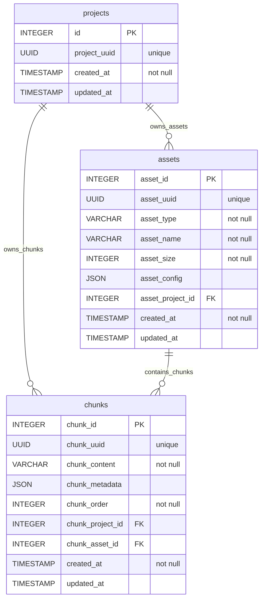

# Legacy RAG SQL Schema

This schema belongs to the older `RAG/src` application. The current integration-ready RAG service in `RAG/app` uses Qdrant by default, so use these tables only when running or maintaining the legacy API.

## Tables

| ORM class | Table | Purpose |
| --- | --- | --- |
| `Project` | `projects` | Legacy RAG project record. |
| `Asset` | `assets` | Uploaded file metadata for a project. |
| `DataChunk` | `chunks` | Processed text chunks linked to a project and asset. |

## ERD

## Notes

- `RAG/src/main.py` can create missing tables on startup.
- Alembic files live in `alembic/`; see `alembic/README` for migration commands.
- These tables use generic names such as `projects`, so avoid sharing the same database with other CadArena schemas unless the deployment is reviewed.
