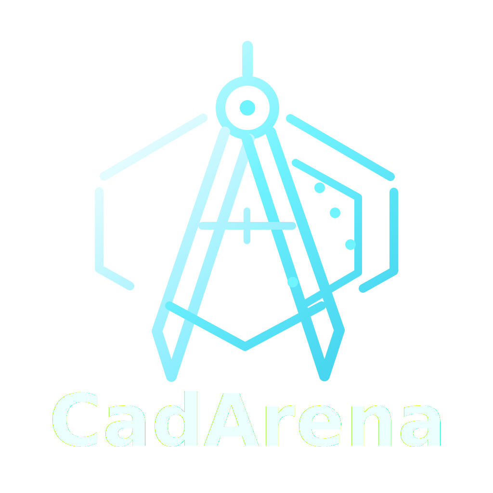
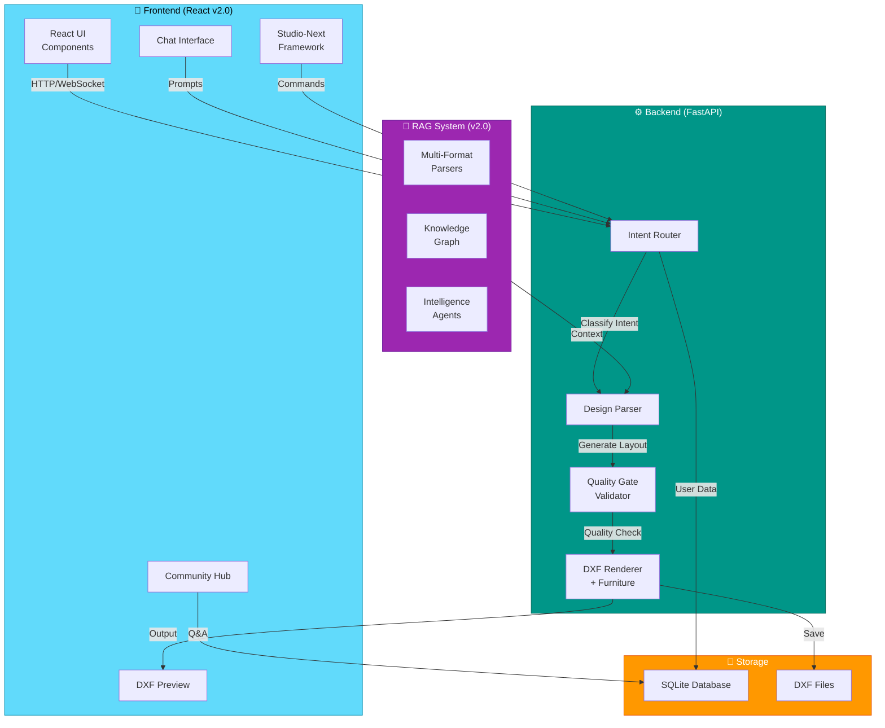
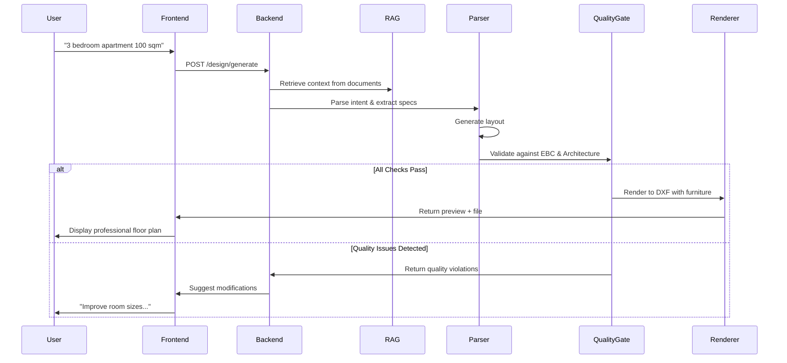
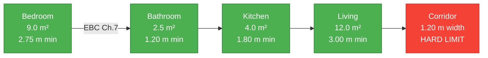
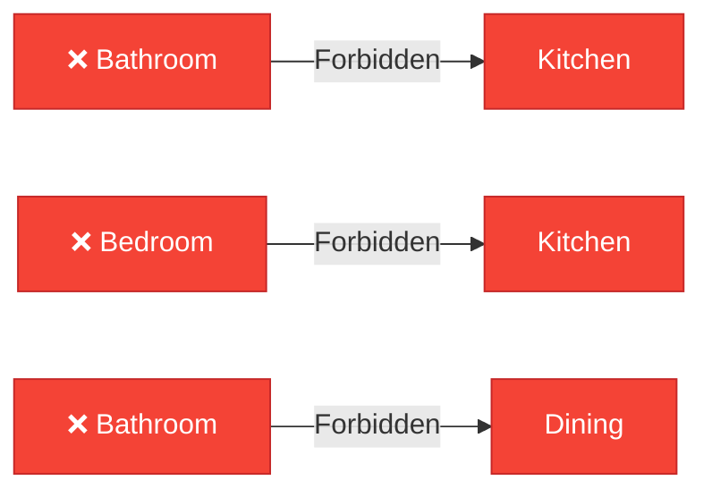

# CadArena

<div align="center">



**AI-Assisted Platform for Civil and Architectural Workflows**

[](https://github.com/Youssefx64/CadArena/releases/tag/v2.0.0)
[](LICENSE)
[](https://www.python.org/)
[](https://react.dev/)
[](https://fastapi.tiangolo.com/)
[](https://www.docker.com/)

[Quick Start](#quick-start) • [Features](#features) • [Architecture](#architecture) • [Documentation](#documentation)

</div>

---

## 🎯 What is CadArena?

CadArena is an **AI-powered architectural design platform** that transforms natural language prompts into professional CAD floor plans. Whether you're an architect, engineer, or designer, CadArena streamlines your workflow with intelligent design generation, real-time preview, and compliance checking.

### The Problem We Solve

- ⏱️ **Time-consuming manual drafting** → AI generates layouts in seconds
- 🔄 **Iterative design cycles** → Chat-driven modifications
- 📋 **Building code compliance** → Automatic EBC 2023 validation
- 🌍 **Language barriers** → Arabic & English support
- 💾 **Format compatibility** → DXF export for AutoCAD/Revit

---

## ✨ Key Features

### 🏗️ Core Capabilities


### 🎨 Platform Features

| Feature | Description |
| --- | --- |
| **AI-Powered Generation** | Convert prompts to professional floor plans instantly |
| **Real-time Preview** | See changes as you describe them |
| **DXF Export** | Compatible with AutoCAD, Revit, and other CAD tools |
| **EBC 2023 Compliance** | Automatic validation against Egyptian Building Code |
| **Community Q&A** | Share knowledge and get answers from architects |
| **Multi-language** | Arabic and English support |
| **Responsive Design** | Works on desktop, tablet, and mobile |
| **WCAG 2.1 AA** | Fully accessible to all users |

### 🆕 v2.0.0 Features

| Feature | Description |
| --- | --- |
| **RAG System** | Multi-format document parsers (PDF, DXF, IFC, CSV, XLSX) with knowledge graphs |
| **Quality Gates** | Architectural quality validation ensuring production-ready designs |
| **Studio-Next UI** | Modern component framework with 7 new components (ActivityFeed, Viewport, Inspector, etc.) |
| **Furniture Rendering** | Enhanced DXF with realistic furniture placement |
| **Advanced Agents** | Intelligent orchestration, validation, and extraction agents |
| **Comprehensive Tests** | 100+ tests covering quality gates, parsers, and API endpoints |

---

## 🏛️ Architecture Overview

### System Architecture



### Data Flow



---

## 🚀 Quick Start

### Prerequisites

- **Python** 3.12+
- **Conda** with two environments:
  - `cad` for the main backend API
  - `rag-app` for the standalone RAG API
- **Node.js** 18+
- **npm** or **yarn**
- **Docker** (optional)

### Option 1: Local Development

#### Python Environments

Use dedicated environments:

```bash
# backend environment
conda env create -f environment.yml

# RAG environment (example)
conda create -n rag-app python=3.12 -y
conda run -n rag-app pip install -r RAG/requirements.txt
```

Run the backend API and RAG API together with one command:

```bash
bash ./scripts/run-backend-rag.sh
```

This starts:

- Backend: `http://127.0.0.1:8000`
- RAG: `http://127.0.0.1:8001/rag`

If one of the services is already running on its configured port, the script reuses it and starts only the missing service. You can override env names with:

```bash
BACKEND_ENV_NAME=cad RAG_ENV_NAME=rag-app bash ./scripts/run-backend-rag.sh
```

#### Backend Setup

```bash
cd backend

# Setup environment
cp .env.example .env

# Run backend + RAG from the unified cad environment
../scripts/run-backend-rag.sh
```

#### Frontend Setup

```bash
cd frontend

# Install dependencies
npm install

# Start development server
npm start
```

#### Access the Application

- **React App**: http://localhost:3000
- **Studio**: http://localhost:3000/studio
- **Community**: http://localhost:3000/community
- **API Docs**: http://127.0.0.1:8000/docs

### Option 2: Docker Deployment

```bash
# From project root
docker compose -f docker/docker-compose.yml up --build

# Access at http://localhost:8000
```

---

## 📁 Project Structure

```
CadArena/
├── 📂 backend/                          # FastAPI application
│   ├── app/
│   │   ├── main.py                      # Application entry point
│   │   ├── routes/                      # API endpoints
│   │   ├── models/                      # Database models
│   │   ├── schemas/                     # Pydantic schemas
│   │   ├── services/
│   │   │   ├── design_parser/           # Layout generation engine
│   │   │   │   ├── quality_gate.py      # ✨ NEW: Architectural quality validation
│   │   │   │   ├── layout_planner.py    # Spatial planning
│   │   │   │   ├── layout_validator.py  # EBC compliance
│   │   │   │   ├── opening_planner.py   # Door/window placement
│   │   │   │   └── orchestrator.py      # Service orchestration
│   │   │   ├── dxf_render_data.py       # ✨ NEW: Render configuration
│   │   │   ├── intent_router.py         # Intent classification
│   │   │   └── dxf_room_renderer.py     # DXF generation with furniture
│   │   ├── utils/
│   │   │   └── design_prompt.py         # System prompts
│   │   └── tests/                       # Comprehensive test suite
│   ├── requirements.txt
│   ├── .env.example
│   └── README.md
│
├── 📂 RAG/                              # ✨ NEW: RAG System (v2.0)
│   ├── app/
│   │   ├── main.py
│   │   ├── parsers/                     # Multi-format document parsers
│   │   │   ├── pdf.py
│   │   │   ├── dxf.py
│   │   │   ├── ifc.py
│   │   │   ├── csv.py
│   │   │   └── xlsx.py
│   │   ├── agents/                      # Intelligence agents
│   │   │   ├── orchestrator.py
│   │   │   ├── validation.py
│   │   │   └── extraction.py
│   │   ├── knowledge_graph.py           # Semantic knowledge mapping
│   │   ├── vector_store.py              # Vector embeddings
│   │   └── router.py                    # RAG API endpoints
│   ├── tests/                           # RAG system tests
│   ├── requirements.txt
│   └── README.md
│
├── 📂 frontend/                         # React application
│   ├── src/
│   │   ├── components/
│   │   │   ├── studio-next/             # ✨ NEW: Modern UI Framework
│   │   │   │   ├── ActivityFeedNext.js  # Activity tracking
│   │   │   │   ├── EngineeringViewportNext.js  # CAD viewport
│   │   │   │   ├── InspectorTabsNext.js # Property inspector
│   │   │   │   ├── ProjectExplorerNext.js # Project browser
│   │   │   │   └── WorkspaceShellNext.js # Layout framework
│   │   │   ├── illustrations/           # ✨ NEW: Visual assets
│   │   │   ├── IconRegistry.js          # ✨ NEW: Icon management
│   │   │   └── ...
│   │   ├── pages/
│   │   │   ├── FeaturesPage.js          # ✨ NEW: Features showcase
│   │   │   ├── StudioNextPage.js        # ✨ NEW: New interface
│   │   │   ├── NotFoundPage.js          # ✨ NEW: 404 handling
│   │   │   └── ...
│   │   ├── services/api.js              # Enhanced API client
│   │   └── ...
│   ├── public/
│   │   ├── assets/
│   │   │   └── cadarena-social-card.png # ✨ NEW: Brand asset
│   │   └── ...
│   ├── package.json
│   ├── tailwind.config.js
│   ├── jest.config.js
│   └── README.md
│
├── 📂 docker/                           # Container setup
│   ├── Dockerfile
│   ├── docker-compose.yml
│   └── README.md
│
├── 📂 docs/                             # Documentation
├── .dockerignore
├── .gitignore
├── LICENSE
└── README.md
```

---

## 🛠️ Tech Stack

### Backend

| Technology | Version | Purpose |
| --- | --- | --- |
| **Python** | 3.12+ | Core language |
| **FastAPI** | 0.100+ | Web framework |
| **SQLAlchemy** | 2.0+ | ORM |
| **Pydantic** | 2.0+ | Data validation |
| **Uvicorn** | 0.23+ | ASGI server |
| **pytest** | 7.0+ | Testing |
| **ezdxf** | 1.0+ | DXF generation |

### RAG System (v2.0)

| Technology | Purpose |
| --- | --- |
| **LangChain** | LLM orchestration |
| **FAISS / Qdrant** | Vector embeddings & search |
| **PyPDF2 / pptx** | Document parsing |
| **Ollama** | Local LLM inference |
| **NetworkX** | Knowledge graph construction |

### Frontend

| Technology | Version | Purpose |
| --- | --- | --- |
| **React** | 18+ | UI framework |
| **Tailwind CSS** | 3.0+ | Styling |
| **Framer Motion** | 10+ | Animations |
| **Lucide React** | Latest | Icons |
| **Jest** | 29+ | Testing |
| **React Testing Library** | 14+ | Component testing |

### DevOps

| Technology | Purpose |
| --- | --- |
| **Docker** | Containerization |
| **Docker Compose** | Orchestration |
| **Git** | Version control |

---

## 🧪 Testing

### Run Tests

```bash
# Backend tests
cd backend
pytest app/tests -v

# Frontend tests
cd frontend
npm test

# With coverage
pytest app/tests --cov=app
npm test -- --coverage
```

### Test Coverage

- **Backend**: Unit tests, integration tests, API tests
- **Frontend**: Component tests, hook tests, utility tests
- **EBC Compliance**: 15+ test cases for building code validation

---

## 🐳 Docker Deployment

### Quick Start

```bash
docker compose -f docker/docker-compose.yml up --build
```

### Features

- ✅ Multi-stage build for optimized images
- ✅ Non-root user for security
- ✅ Health checks for monitoring
- ✅ Volume persistence for data
- ✅ Network isolation
- ✅ Environment configuration

See [docker/README.md](docker/README.md) for detailed instructions.

---

## 📚 Documentation

- **[Backend README](backend/README.md)** - API documentation and setup
- **[Frontend README](frontend/README.md)** - Component guide and development
- **[Docker README](docker/README.md)** - Deployment and containerization
- **[Architecture](docs/ARCHITECTURE.md)** - System design and decisions
- **[API Reference](docs/API.md)** - Complete API documentation

---

## 🏛️ Building Code Compliance

CadArena enforces **Egyptian Building Code (EBC 2023)** standards:

### Minimum Room Dimensions



### Apartment Type Standards

| Type | Min Area | Typical Rooms |
| --- | --- | --- |
| **Studio** | 25–45 m² | 1 room + kitchen + bathroom |
| **1-Bedroom** | 45–75 m² | 1 bed + living + kitchen + bathroom |
| **2-Bedroom** | 75–120 m² | 2 beds + living + kitchen + bathroom |
| **3-Bedroom** | 100–160 m² | 3 beds + living + kitchen + 2 bathrooms |
| **4-Bedroom** | 140–220 m² | 4 beds + living + kitchen + 2 bathrooms |
| **Villa** | 200–500 m² | Multiple zones + outdoor spaces |

### Forbidden Adjacencies



---

## 🤝 Contributing

We welcome contributions! Here's how:

1. **Fork** the repository
2. **Create** a feature branch (`git checkout -b feature/amazing-feature`)
3. **Make** your changes and commit (`git commit -m 'Add amazing feature'`)
4. **Push** to the branch (`git push origin feature/amazing-feature`)
5. **Open** a Pull Request

### Development Guidelines

- Follow existing code style
- Write tests for new features
- Update documentation
- Ensure all tests pass
- Keep commits atomic and well-documented

---

## 🔒 Security

- Non-root Docker user
- Environment variable management
- Input validation and sanitization
- CORS configuration
- Rate limiting
- Security headers

For security concerns: security@cadarena.dev

---

## 📝 License

This project is licensed under the MIT License - see [LICENSE](LICENSE) for details.

---

## 🙋 Support & Community

### Getting Help

- 📖 [Documentation](docs/)
- 💬 [Community Discussions](https://cadarena.dev/community)
- 🐛 [Report Issues](https://github.com/cadarena/cadarena/issues)
- 💡 [Feature Requests](https://github.com/cadarena/cadarena/discussions)

### Connect With Us

- **Website**: [cadarena.dev](https://cadarena.dev)
- **Community**: [cadarena.dev/community](https://cadarena.dev/community)
- **Email**: cadarena.ai@gmail.com

---

## 🎉 Acknowledgments

Built with ❤️ using:

- [FastAPI](https://fastapi.tiangolo.com/) - Modern Python web framework
- [React](https://react.dev/) - UI library
- [Tailwind CSS](https://tailwindcss.com/) - Utility-first CSS
- [Framer Motion](https://www.framer.com/motion/) - Animation library
- [Lucide React](https://lucide.dev/) - Icon library
- [Jest](https://jestjs.io/) - Testing framework
- [pytest](https://pytest.org/) - Python testing

---

## 📊 Project Statistics

- **Latest Release**: v2.0.0 (June 30, 2026)
- **Backend**: Python + FastAPI
- **Frontend**: React + Tailwind CSS
- **RAG System**: Multi-format parsers + Knowledge graphs
- **Tests**: 120+ test cases
- **Components**: 30+ reusable components (including 7 new Studio-Next components)
- **API Endpoints**: 40+ endpoints
- **New Files (v2.0.0)**: 78 new files
- **Total Commits (v2.0.0)**: 20 well-organized commits
- **Documentation**: Comprehensive
- **Accessibility**: WCAG 2.1 AA compliant
- **Building Code**: EBC 2023 compliant

### v2.0.0 Release Highlights

```
✨ Complete RAG System with Multi-Format Parsers
   - PDF, DXF, IFC, CSV, XLSX document ingestion
   - Knowledge graph for semantic relationships
   - Intelligent agent framework

🏛️ Architectural Quality Gates
   - Production-ready design validation
   - Comprehensive violation reporting
   - Tolerance modes for iterative design

🎨 Modern Studio-Next UI Framework
   - 7 new professional components
   - Enhanced viewport and inspector
   - Activity feed and timeline

📊 Enhanced DXF Rendering
   - Realistic furniture placement
   - Multi-floor support
   - Improved layer organization

✅ Comprehensive Testing
   - 120+ test cases
   - Quality gate validation tests
   - Multi-format parser tests
   - API integration tests
```

---

## 📝 Release Notes

### v2.0.0 - Major Release (June 30, 2026)

**New Features:**
- 🤖 Complete RAG system with multi-format document parsers and knowledge graphs
- 🏛️ Architectural quality gate validation for production-ready designs
- 🎨 Modern studio-next UI framework with 7 new professional components
- 📊 Enhanced DXF rendering with realistic furniture and multi-floor support
- 🧠 Intelligent agent framework for document extraction and validation
- 📚 Multi-format document support (PDF, DXF, IFC, CSV, XLSX, TXT, images)

**Improvements:**
- ✨ Better validation thresholds for layout quality
- 🔧 Enhanced design parser orchestration
- 📈 Improved error handling and diagnostics
- 🎯 Better user experience with new UI components
- 🧪 Comprehensive test suite (120+ tests)

**Breaking Changes:**
- ❌ Removed outdated ArchVisionPage component
- 📊 Updated validation thresholds for better quality (window ratio 0.05→0.10)

**Commits:** 20 well-organized commits covering RAG, Quality Gates, DXF rendering, and UI enhancements

[View Full Changelog](https://github.com/Youssefx64/CadArena/releases/tag/v2.0.0)

---

**Made with ❤️ by the CadArena Team**

[⬆ Back to top](#cadarena)

</div>
