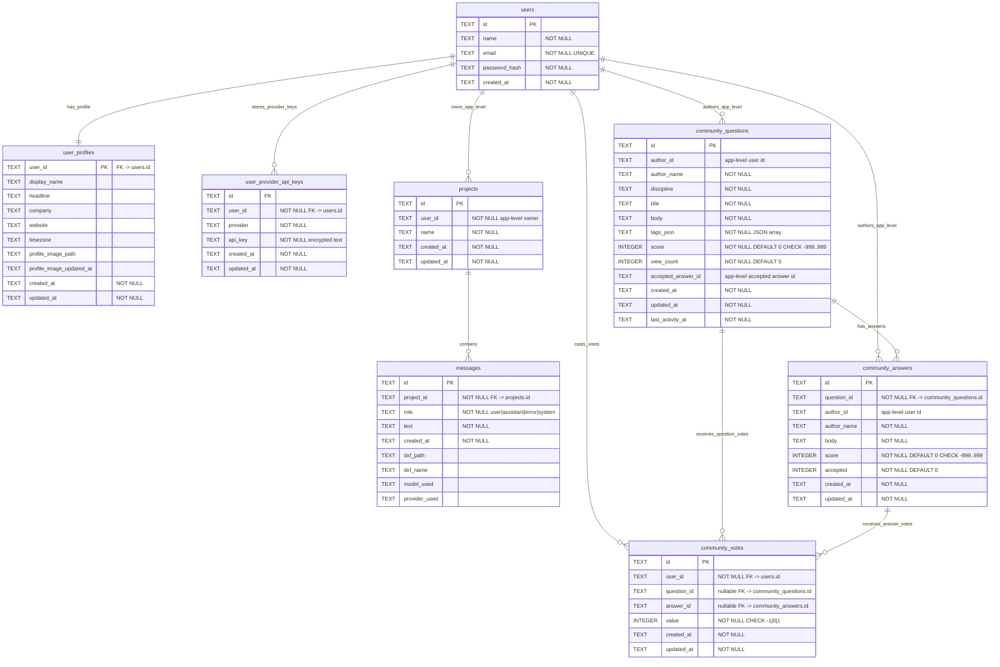

# Database ERD - CadArena

## Overview
CadArena currently uses a single SQLite database file for workspace, authentication, profile, provider-key, and community data. The path is resolved by `workspace_db_path()`:

- `CADARENA_WORKSPACE_DB_PATH` when configured
- otherwise `backend/data/workspace.db`

The database is initialized by three startup routines:

- `init_workspace_db()` creates `projects` and `messages`
- `init_auth_db()` creates `users`, `user_profiles`, and `user_provider_api_keys`
- `init_community_db()` creates `community_questions`, `community_answers`, and `community_votes`

All storage connections enable `PRAGMA foreign_keys = ON`. Some ownership links are enforced by application queries rather than SQLite foreign keys, especially `projects.user_id`, `community_questions.author_id`, and `community_answers.author_id`.

## Relationship Diagram

## Table Reference

### users
| Column | Type | Constraints |
| --- | --- | --- |
| id | TEXT | PRIMARY KEY |
| name | TEXT | NOT NULL |
| email | TEXT | NOT NULL, UNIQUE |
| password_hash | TEXT | NOT NULL |
| created_at | TEXT | NOT NULL |

Indexes:
- `idx_users_email` on `email` (unique)

Notes:
- Created by `auth_storage.create_user`.
- A matching `user_profiles` row is inserted during user creation.

### user_profiles
| Column | Type | Constraints |
| --- | --- | --- |
| user_id | TEXT | PRIMARY KEY, FK to `users.id`, ON DELETE CASCADE |
| display_name | TEXT | Optional |
| headline | TEXT | Optional |
| company | TEXT | Optional |
| website | TEXT | Optional |
| timezone | TEXT | Optional |
| profile_image_path | TEXT | Optional relative output path |
| profile_image_updated_at | TEXT | Optional timestamp |
| created_at | TEXT | NOT NULL |
| updated_at | TEXT | NOT NULL |

Notes:
- `auth_storage._ensure_profile_columns` adds `profile_image_path` and `profile_image_updated_at` to older databases.
- Avatar files are stored under `backend/output/profile_images`, while this table stores the relative path.

### user_provider_api_keys
| Column | Type | Constraints |
| --- | --- | --- |
| id | TEXT | PRIMARY KEY |
| user_id | TEXT | NOT NULL, FK to `users.id`, ON DELETE CASCADE |
| provider | TEXT | NOT NULL |
| api_key | TEXT | NOT NULL |
| created_at | TEXT | NOT NULL |
| updated_at | TEXT | NOT NULL |

Constraints:
- `UNIQUE(user_id, provider)`

Indexes:
- `idx_user_provider_keys_user` on `user_id`
- `idx_user_provider_keys_provider` on `provider`

Notes:
- Provider keys are encrypted with Fernet using `PROVIDER_KEY_SECRET` before storage.
- Supported providers are `openai`, `anthropic`, `google`, `huggingface`, `groq`, `azure_openai`, and `ollama`.

### projects
| Column | Type | Constraints |
| --- | --- | --- |
| id | TEXT | PRIMARY KEY |
| user_id | TEXT | NOT NULL, application-level owner |
| name | TEXT | NOT NULL |
| created_at | TEXT | NOT NULL |
| updated_at | TEXT | NOT NULL |

Indexes:
- `idx_projects_user` on `user_id`

Notes:
- `projects.user_id` is not an SQLite foreign key. Ownership is enforced by `WHERE p.user_id = ?` in workspace queries.
- Guest users and authenticated users both use this table; authenticated routes hydrate `user_id` from the JWT user.

### messages
| Column | Type | Constraints |
| --- | --- | --- |
| id | TEXT | PRIMARY KEY |
| project_id | TEXT | NOT NULL, FK to `projects.id`, ON DELETE CASCADE |
| role | TEXT | NOT NULL, CHECK role in `user`, `assistant`, `error`, `system` |
| text | TEXT | NOT NULL |
| created_at | TEXT | NOT NULL |
| dxf_path | TEXT | Optional server-side DXF path |
| dxf_name | TEXT | Optional browser download name |
| model_used | TEXT | Optional parser model id |
| provider_used | TEXT | Optional provider id |

Indexes:
- `idx_messages_project` on `(project_id, created_at)`

Notes:
- `workspace_storage.add_message` updates the parent project `updated_at` timestamp in the same transaction.
- When messages are serialized, `dxf_path` is converted into a workspace-scoped `file_token`; the raw path is not returned to the browser.

### community_questions
| Column | Type | Constraints |
| --- | --- | --- |
| id | TEXT | PRIMARY KEY |
| author_id | TEXT | Optional app-level user id |
| author_name | TEXT | NOT NULL |
| discipline | TEXT | NOT NULL |
| title | TEXT | NOT NULL |
| body | TEXT | NOT NULL |
| tags_json | TEXT | NOT NULL JSON array |
| score | INTEGER | NOT NULL DEFAULT 0, CHECK score between -999 and 999 |
| view_count | INTEGER | NOT NULL DEFAULT 0 |
| accepted_answer_id | TEXT | Optional app-level accepted answer id |
| created_at | TEXT | NOT NULL |
| updated_at | TEXT | NOT NULL |
| last_activity_at | TEXT | NOT NULL |

Indexes:
- `idx_community_questions_activity` on `last_activity_at DESC`
- `idx_community_questions_created` on `created_at DESC`
- `idx_community_questions_discipline` on `discipline`
- `idx_community_questions_author_id` on `author_id`

Notes:
- `author_id` is nullable and not a SQLite foreign key, allowing guest-authored questions with a display name.
- Tags are stored as JSON text and normalized in application code.
- `accepted_answer_id` is present in the schema but is not enforced as a foreign key.

### community_answers
| Column | Type | Constraints |
| --- | --- | --- |
| id | TEXT | PRIMARY KEY |
| question_id | TEXT | NOT NULL, FK to `community_questions.id`, ON DELETE CASCADE |
| author_id | TEXT | Optional app-level user id |
| author_name | TEXT | NOT NULL |
| body | TEXT | NOT NULL |
| score | INTEGER | NOT NULL DEFAULT 0, CHECK score between -999 and 999 |
| accepted | INTEGER | NOT NULL DEFAULT 0 |
| created_at | TEXT | NOT NULL |
| updated_at | TEXT | NOT NULL |

Indexes:
- `idx_community_answers_question` on `(question_id, created_at)`
- `idx_community_answers_author_id` on `author_id`
- `idx_community_answers_accepted_score` on `(accepted DESC, score DESC)`

Notes:
- Deleting a question cascades to its answers.
- Adding an answer updates the parent question `updated_at` and `last_activity_at`.

### community_votes
| Column | Type | Constraints |
| --- | --- | --- |
| id | TEXT | PRIMARY KEY |
| user_id | TEXT | NOT NULL, FK to `users.id`, ON DELETE CASCADE |
| question_id | TEXT | Optional FK to `community_questions.id`, ON DELETE CASCADE |
| answer_id | TEXT | Optional FK to `community_answers.id`, ON DELETE CASCADE |
| value | INTEGER | NOT NULL, CHECK value in -1, 0, 1 |
| created_at | TEXT | NOT NULL |
| updated_at | TEXT | NOT NULL |

Constraints:
- `UNIQUE(user_id, question_id)`
- `UNIQUE(user_id, answer_id)`

Indexes:
- `idx_community_votes_user` on `user_id`

Notes:
- The table is created by `init_community_db` for per-user vote tracking.
- Current `vote_question` and `vote_answer` service functions update aggregate scores directly and do not yet insert rows into `community_votes`.

## Relationship Index
- `user_profiles.user_id -> users.id` (FK, ON DELETE CASCADE)
- `user_provider_api_keys.user_id -> users.id` (FK, ON DELETE CASCADE)
- `messages.project_id -> projects.id` (FK, ON DELETE CASCADE)
- `community_answers.question_id -> community_questions.id` (FK, ON DELETE CASCADE)
- `community_votes.user_id -> users.id` (FK, ON DELETE CASCADE)
- `community_votes.question_id -> community_questions.id` (FK, ON DELETE CASCADE)
- `community_votes.answer_id -> community_answers.id` (FK, ON DELETE CASCADE)
- `projects.user_id -> users.id` (application-level link, no FK)
- `community_questions.author_id -> users.id` (application-level link, no FK)
- `community_answers.author_id -> users.id` (application-level link, no FK)
- `community_questions.accepted_answer_id -> community_answers.id` (application-level link, no FK)

## Design Notes
- One database file keeps local development simple while separate storage modules keep auth, workspace, and community logic isolated.
- Cascading deletes are used where the schema owns child rows directly, such as profiles, provider keys, messages, answers, and vote rows.
- Guest workspace support is the reason several user ownership links remain application-level rather than strict SQLite foreign keys.
- File artifacts are not stored as blobs; the database stores metadata and paths, while file access is mediated through session or workspace file tokens.
