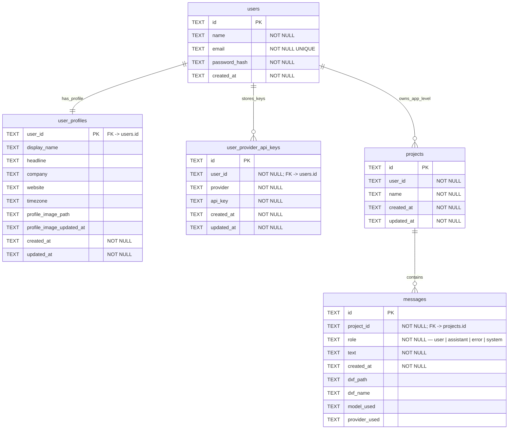

# Database ERD — CadArena

## نظرة عامة
قاعدة البيانات الفعلية هي SQLite واحدة (`workspace.db`) وتضم جداول المستخدمين والملفات الشخصية ومفاتيح المزودات، بالإضافة إلى مشاريع workspace ورسائلها. العلاقة الوحيدة المعرّفة على مستوى قاعدة البيانات بين المشاريع والرسائل هي FK مع حذف متسلسل، بينما ملكية المشاريع للمستخدمين هي رابط تطبيقي بدون FK.

## مخطط العلاقات

## وصف الجداول

### users
| الحقل | النوع | القيود |
| --- | --- | --- |
| id | TEXT | PK |
| name | TEXT | NOT NULL |
| email | TEXT | NOT NULL, UNIQUE |
| password_hash | TEXT | NOT NULL |
| created_at | TEXT | NOT NULL |

Indexes:
- idx_users_email (email)

### user_profiles
| الحقل | النوع | القيود |
| --- | --- | --- |
| user_id | TEXT | PK, FK → users.id, ON DELETE CASCADE |
| display_name | TEXT | — |
| headline | TEXT | — |
| company | TEXT | — |
| website | TEXT | — |
| timezone | TEXT | — |
| profile_image_path | TEXT | — |
| profile_image_updated_at | TEXT | — |
| created_at | TEXT | NOT NULL |
| updated_at | TEXT | NOT NULL |

### user_provider_api_keys
| الحقل | النوع | القيود |
| --- | --- | --- |
| id | TEXT | PK |
| user_id | TEXT | NOT NULL, FK → users.id, ON DELETE CASCADE |
| provider | TEXT | NOT NULL |
| api_key | TEXT | NOT NULL |
| created_at | TEXT | NOT NULL |
| updated_at | TEXT | NOT NULL |

Constraints:
- UNIQUE(user_id, provider)

Indexes:
- idx_user_provider_keys_user (user_id)
- idx_user_provider_keys_provider (provider)

### projects
| الحقل | النوع | القيود |
| --- | --- | --- |
| id | TEXT | PK |
| user_id | TEXT | NOT NULL (app-level link) |
| name | TEXT | NOT NULL |
| created_at | TEXT | NOT NULL |
| updated_at | TEXT | NOT NULL |

Indexes:
- idx_projects_user (user_id)

### messages
| الحقل | النوع | القيود |
| --- | --- | --- |
| id | TEXT | PK |
| project_id | TEXT | NOT NULL, FK → projects.id, ON DELETE CASCADE |
| role | TEXT | NOT NULL, CHECK(role IN 'user','assistant','error','system') |
| text | TEXT | NOT NULL |
| created_at | TEXT | NOT NULL |
| dxf_path | TEXT | — |
| dxf_name | TEXT | — |
| model_used | TEXT | — |
| provider_used | TEXT | — |

Indexes:
- idx_messages_project (project_id, created_at)

## قرارات التصميم
- جداول المستخدمين والملفات الشخصية ومفاتيح المزودات تعتمد على FK مع حذف متسلسل لضمان تنظيف البيانات عند حذف المستخدم.
- علاقة المشاريع بالمستخدمين ليست FK على مستوى SQLite، لذلك تبقى ملكية المشروع رابطة تطبيقية فقط.
- جدول الرسائل يرتبط بالمشاريع عبر FK مع ON DELETE CASCADE لتصفية الرسائل عند حذف المشروع.
- يوجد مسار ترميمي في الكود لإضافة أعمدة الصور الشخصية (`profile_image_path`, `profile_image_updated_at`) إذا كانت قاعدة البيانات قديمة.

## فهرس العلاقات
- user_profiles.user_id → users.id (FK, ON DELETE CASCADE)
- user_provider_api_keys.user_id → users.id (FK, ON DELETE CASCADE)
- messages.project_id → projects.id (FK, ON DELETE CASCADE)
- projects.user_id → users.id (app-level link, no FK)
