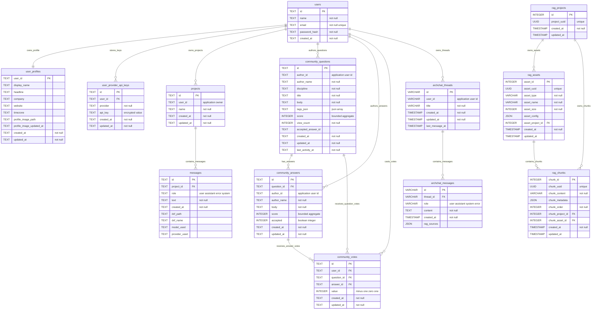

# Database ERD - CadArena

## Purpose
This document defines the relational data model used by CadArena's backend services. It is written for academic documentation and uses valid Mermaid ER diagram syntax.

## Database Scope
CadArena currently uses a PostgreSQL-compatible persistence layer for the main backend. The connection is resolved from `CADARENA_DATABASE_URL` by `backend/app/services/postgres_compat.py`. Storage modules still use a compatibility API with `?` placeholders, but requests are executed through `psycopg2`.

The backend initializes these data areas during FastAPI startup:

- Workspace storage: `projects` and `messages`
- Authentication and profile storage: `users`, `user_profiles`, and `user_provider_api_keys`
- Community storage: `community_questions`, `community_answers`, and `community_votes`
- ArchChat storage: `archchat_threads` and `archchat_messages` when `CADARENA_DATABASE_URL` or `CADARENA_ARCHCHAT_DATABASE_URL` is configured

The standalone RAG API under `RAG/app` uses local Qdrant storage by default and does not create relational tables. The older RAG application under `RAG/src` defines a separate SQLAlchemy schema with tables named `projects`, `assets`, and `chunks`; they are shown below with a `rag_` prefix only to distinguish them from the backend workspace tables in this documentation diagram.

## Relationship Diagram

## Main Backend Tables

| Table | Service owner | Notes |
| --- | --- | --- |
| `users` | Authentication | Stores account identity and password hash. |
| `user_profiles` | Profile | Stores display profile, website, timezone, and avatar metadata. |
| `user_provider_api_keys` | Profile | Stores encrypted provider API keys with `UNIQUE(user_id, provider)`. |
| `projects` | Workspace | Stores user-scoped workspace projects. Ownership is enforced by service queries. |
| `messages` | Workspace | Stores chat history and generated DXF metadata for a project. |
| `community_questions` | Community | Stores engineering questions with tags, discipline, score, views, and activity timestamps. |
| `community_answers` | Community | Stores answers for questions with accepted and score fields. |
| `community_votes` | Community | Stores the intended per-user voting model for question and answer votes. |
| `archchat_threads` | ArchChat | Stores authenticated RAG chat threads. |
| `archchat_messages` | ArchChat | Stores thread messages and optional RAG source metadata. |

## Integrity Rules

- `user_profiles.user_id` and `user_provider_api_keys.user_id` reference `users.id` with cascade deletion.
- `messages.project_id` references `projects.id` with cascade deletion.
- `community_answers.question_id` references `community_questions.id` with cascade deletion.
- `community_votes.user_id`, `community_votes.question_id`, and `community_votes.answer_id` reference their parent tables with cascade deletion.
- `archchat_messages.thread_id` references `archchat_threads.id` with cascade deletion through SQLAlchemy relationships.
- `projects.user_id`, `community_questions.author_id`, `community_answers.author_id`, and `archchat_threads.user_id` are application-level user links resolved by service queries.

## Persistence Notes

- Generated DXF, PNG, PDF, and avatar files are stored on disk under `backend/output`; database rows store metadata and paths rather than binary content.
- File access is mediated by session or workspace file tokens from `file_token_registry`.
- Provider API keys are encrypted with Fernet using `PROVIDER_KEY_SECRET`.
- ArchChat can use the unified backend database URL or its own `CADARENA_ARCHCHAT_DATABASE_URL`.
- The RAG service stores vectors under `RAG/data/qdrant_db` when `RAG_VECTOR_STORE=QDRANT`.
