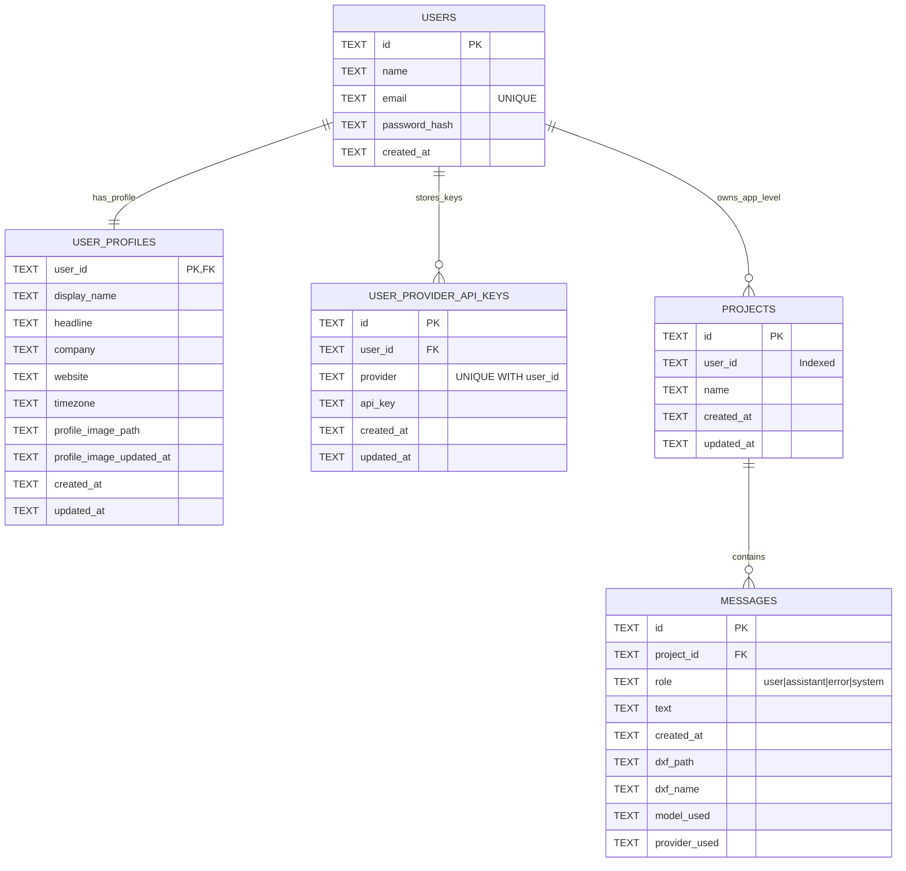

# CadArena Database ERD

Notes:
- `PROJECTS.user_id` is currently an application-level ownership link (no DB-level foreign key constraint).
- `USER_PROVIDER_API_KEYS` enforces unique pairs for `(user_id, provider)`.
- Cascading delete is enforced from `USERS -> USER_PROFILES`, `USERS -> USER_PROVIDER_API_KEYS`, and `PROJECTS -> MESSAGES`.

