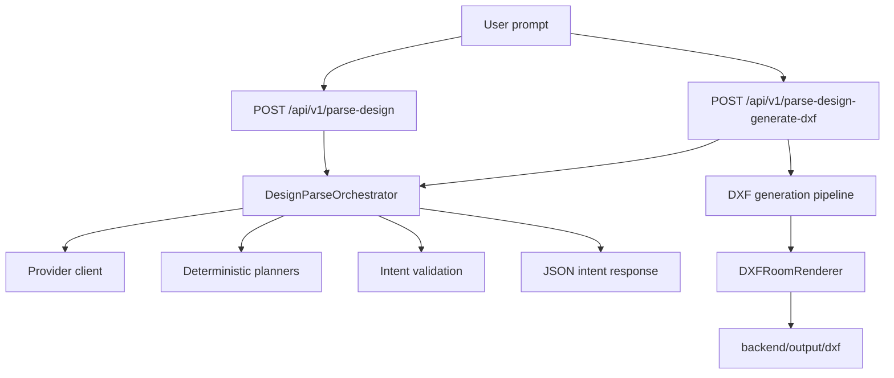
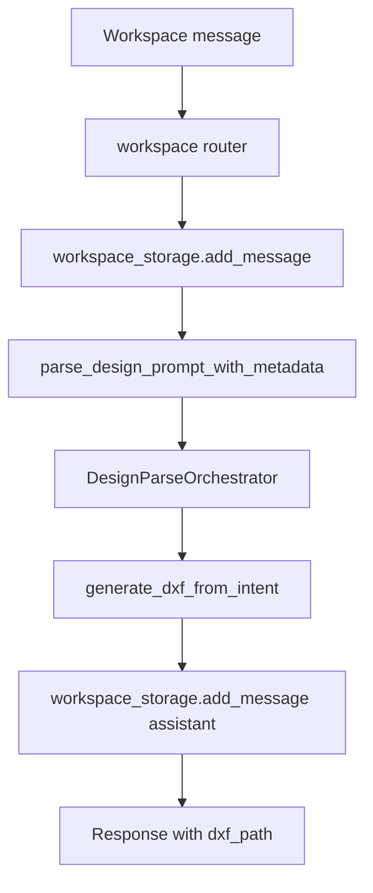
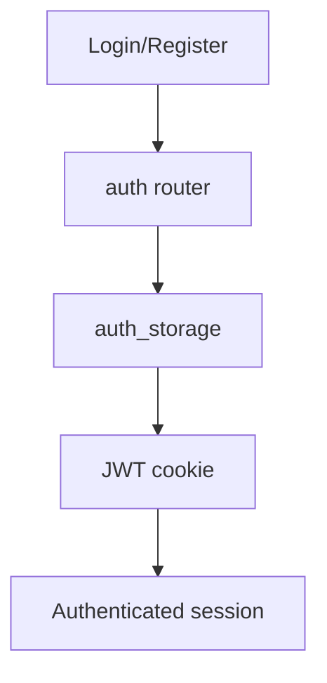
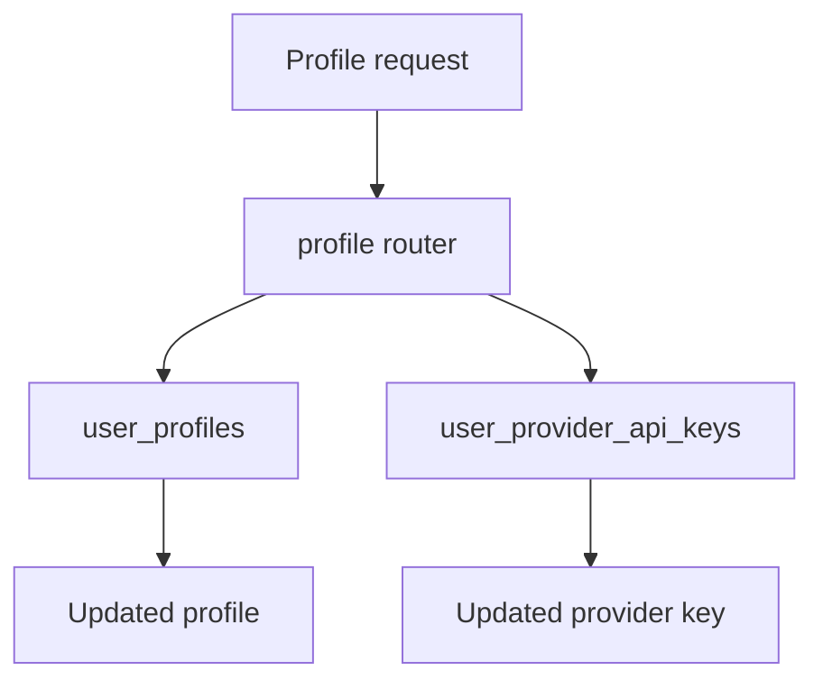
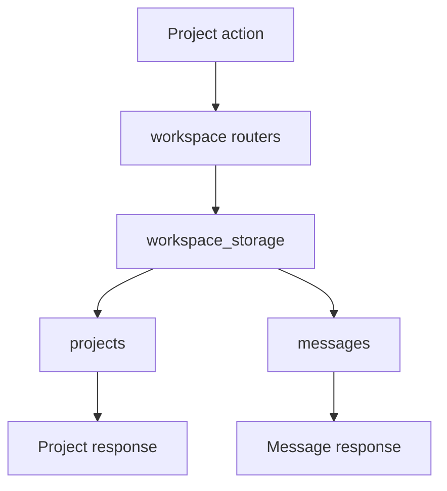
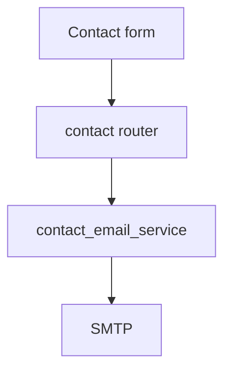
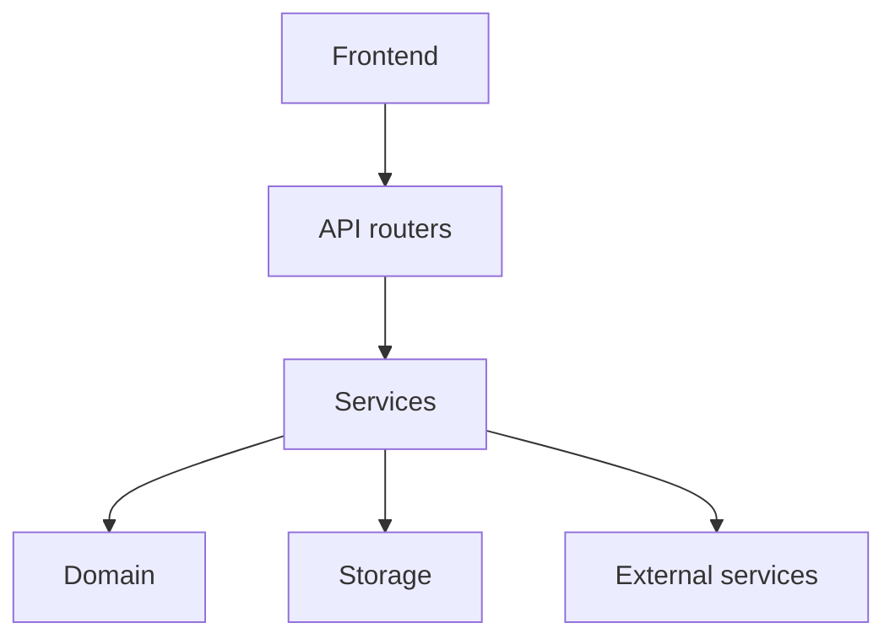
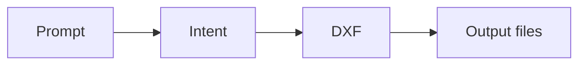

---
# System Flow — CadArena

## Overview
CadArena is a FastAPI-backed architectural CAD platform with a React shell plus a standalone studio iframe. Users can parse prompts, generate DXF, manage projects, upload DXF files, and export preview files.

Actors:
- Guest — local workspace mode without authentication
- Authenticated User — JWT-backed persistence and profile management
- External Services — Ollama, HuggingFace, SMTP, filesystem, SQLite

## Flow 1: Prompt Parsing


## Flow 2: Workspace Generation


## Flow 3: Authentication


## Flow 4: Profile and Provider Keys


## Flow 5: Workspace Projects


## Flow 6: DXF Utilities
```mermaid
flowchart TD
    A[DXF action] --> B[/api/v1/dxf/upload]
    A --> C[/api/v1/dxf/preview]
    A --> D[/api/v1/dxf/export]
    B --> E[Stored DXF token]
    C --> F[PNG preview]
    D --> G[PNG or PDF export]
```

## Flow 7: Contact Form


## Layer Architecture


## Data Flow Summary

