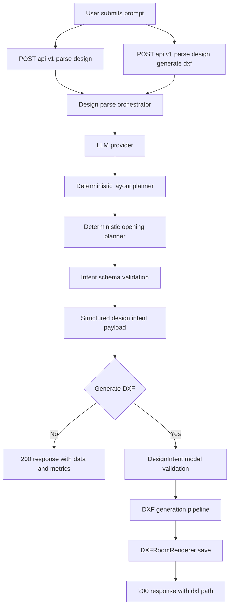
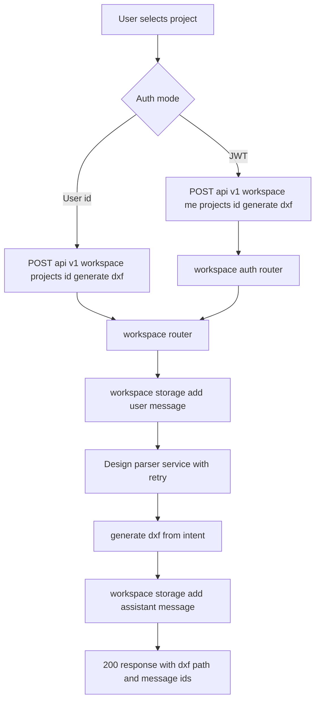
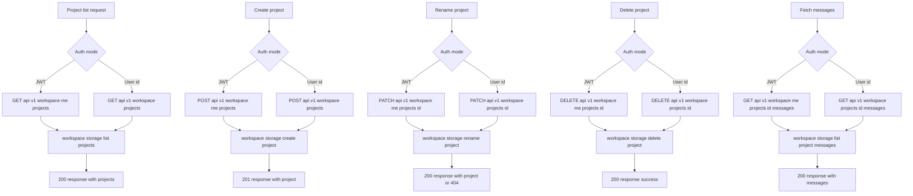
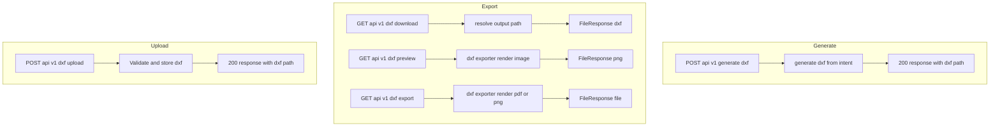
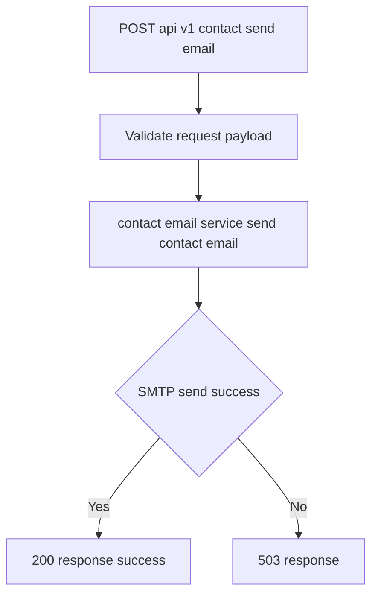
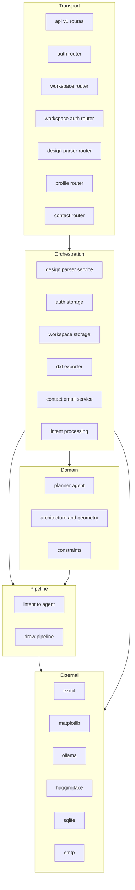
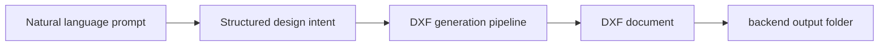

---
# System Flow — CadArena

## Overview

CadArena is a natural-language-to-CAD platform built on FastAPI.
The system accepts architectural descriptions as text, parses them into
structured design intent, validates layout constraints, and generates
DXF files ready for professional CAD use.

Three actors interact with the system:
- **Guest** — uses the studio without authentication (local user_id)
- **Authenticated User** — full workspace persistence via JWT
- **External Services** — LLM providers, SMTP, filesystem, SQLite

---

## Flow 1: Design Parsing and Guest DXF Generation

> Parse natural language into structured intent, optionally returning a DXF path.

Endpoints:
- `GET /api/v1/parse-design-models`
- `POST /api/v1/parse-design`
- `POST /api/v1/parse-design-generate-dxf`

**Key components involved:**
| Component | Location | Responsibility |
|-----------|----------|----------------|
| DesignParseOrchestrator | app/services/design_parser/orchestrator.py | Orchestrates prompt compile, provider calls, planning, and validation |
| DeterministicLayoutPlanner | app/services/design_parser/layout_planner.py | Generates room placements from extracted programs |
| DeterministicOpeningPlanner | app/services/design_parser/opening_planner.py | Derives doors and windows from planned rooms |
| LayoutValidator | app/services/design_parser/layout_validator.py | Enforces deterministic layout rules and scoring |
| IntentValidator | app/services/design_parser/intent_validator.py | Validates final parsed payload schema |
| save_parse_design_output | app/utils/parse_output_storage.py | Persists parse output for inspection and reuse |
| DesignIntentValidator | app/services/intent_validation.py | Validates DXF intent before rendering |
| PlannerAgent | app/domain/planner/planner_agent.py | Places rooms without explicit origins |
| DXFRoomRenderer | app/services/dxf_room_renderer.py | Renders DXF entities and saves the file |

---

## Flow 2: Workspace DXF Generation

> Persisted generation with project history and message logging.

Endpoints:
- `POST /api/v1/workspace/projects/{project_id}/generate-dxf` (user_id in body)
- `POST /api/v1/workspace/me/projects/{project_id}/generate-dxf` (JWT)

---

## Flow 3: Authentication

Endpoints:
- `POST /api/v1/auth/register`
- `POST /api/v1/auth/login`
- `POST /api/v1/auth/logout`
- `GET /api/v1/auth/me`
- `GET /api/v1/auth/google/config`
- `POST /api/v1/auth/google`

```mermaid
flowchart TD
    subgraph Register
        R1[POST api v1 auth register] --> R2[auth storage create user]
        R2 --> R3[auth storage create profile]
        R3 --> R4[JWT cookie set]
        R4 --> R5[201 response with user]
    end

    subgraph Login
        L1[POST api v1 auth login] --> L2[auth storage get user by email]
        L2 --> L3{Password valid}
        L3 -->|No| L4[401 invalid credentials]
        L3 -->|Yes| L5[JWT cookie set]
        L5 --> L6[200 response with user]
    end

    subgraph GoogleOAuth
        G1[GET api v1 auth google config] --> G2[Google client id or disabled]
        G3[POST api v1 auth google] --> G4[Verify Google id token]
        G4 --> G5{User exists}
        G5 -->|No| G6[auth storage create user]
        G5 -->|Yes| G7[Load existing user]
        G6 --> G8[JWT cookie set]
        G7 --> G8
        G8 --> G9[200 response with user]
    end

    subgraph Session
        S1[POST api v1 auth logout] --> S2[Clear auth cookie]
        S3[GET api v1 auth me] --> S4[JWT decode access token]
        S4 --> S5[200 response with user]
    end
```

---

## Flow 4: Profile Management

Endpoints:
- `GET /api/v1/profile/me`
- `PATCH /api/v1/profile/me`
- `POST /api/v1/profile/me/avatar`
- `DELETE /api/v1/profile/me/avatar`
- `PUT /api/v1/profile/me/providers/{provider}`
- `DELETE /api/v1/profile/me/providers/{provider}`

```mermaid
flowchart TD
    subgraph Profile
        P1[GET api v1 profile me] --> P2[auth storage ensure user profile]
        P2 --> P3[200 response with profile and providers]
        P4[PATCH api v1 profile me] --> P5[auth storage update user profile]
        P5 --> P6[200 response with updated profile]
    end

    subgraph Avatar
        A1[POST api v1 profile me avatar] --> A2[Validate image and size]
        A2 --> A3[Save file to output profile images]
        A3 --> A4[auth storage update profile image]
        A4 --> A5[200 response with profile]
        A6[DELETE api v1 profile me avatar] --> A7[auth storage update profile image]
        A7 --> A8[Delete previous image file]
        A8 --> A9[200 response with profile]
    end

    subgraph ProviderKeys
        K1[PUT api v1 profile me providers provider] --> K2[auth storage upsert provider key]
        K2 --> K3[200 response with profile]
        K4[DELETE api v1 profile me providers provider] --> K5[auth storage delete provider key]
        K5 --> K6[200 response with profile]
    end
```

---

## Flow 5: Workspace Project Management

Endpoints:
- `GET /api/v1/workspace/projects`
- `POST /api/v1/workspace/projects`
- `PATCH /api/v1/workspace/projects/{project_id}`
- `DELETE /api/v1/workspace/projects/{project_id}`
- `GET /api/v1/workspace/projects/{project_id}/messages`
- `GET /api/v1/workspace/me/projects`
- `POST /api/v1/workspace/me/projects`
- `PATCH /api/v1/workspace/me/projects/{project_id}`
- `DELETE /api/v1/workspace/me/projects/{project_id}`
- `GET /api/v1/workspace/me/projects/{project_id}/messages`

---

## Flow 6: DXF Utilities

Endpoints:
- `POST /api/v1/generate-dxf`
- `GET /api/v1/dxf/download`
- `GET /api/v1/dxf/preview`
- `GET /api/v1/dxf/export`
- `POST /api/v1/dxf/upload`

---

## Flow 7: Contact Form

Endpoint:
- `POST /api/v1/contact/send-email`

---

## Layer Architecture

**Design principle:** Routers handle HTTP only.
Business logic lives exclusively in domain and services.
Pipeline connects validated intent to DXF output.

---

## Data Flow Summary

---

## Mermaid Rules Applied
- No parentheses or special chars inside node labels
- No single quote or double quote inside node labels
- No reserved keywords used as node IDs
- All subgraph names are single words
- All flowchart directions explicit
