# 01 Activity Diagram - Prompt to DXF Workflow - CadArena

## Purpose
This activity diagram describes the current end-to-end workflow that turns a user prompt into a persisted DXF file in CadArena. It reflects the React shell, the embedded Studio workspace, FastAPI routers, the deterministic design parser, the DXF pipeline, file-token handling, and workspace message persistence.

## Diagram

```mermaid
flowchart TD
    START_NODE(["Start"]) --> OPEN_STUDIO["User opens React /studio page"]
    OPEN_STUDIO --> STUDIO_IFRAME["StudioPage loads /studio-app/index.html"]
    STUDIO_IFRAME --> SELECT_PROJECT["Create or select workspace project"]
    SELECT_PROJECT --> ENTER_PROMPT["Enter architectural prompt and select model"]
    ENTER_PROMPT --> HAS_LAYOUT{"Existing project layout?"}

    HAS_LAYOUT -->|"No"| GENERATE_REQUEST["POST /api/v1/workspace/projects/{project_id}/generate-dxf or /workspace/me/projects/{project_id}/generate-dxf"]
    HAS_LAYOUT -->|"Yes"| ITERATE_REQUEST["POST /api/v1/workspace/{project_id}/iterate or /workspace/me/projects/{project_id}/iterate"]

    GENERATE_REQUEST --> BIND_USER["Bind guest cookie or resolve authenticated user"]
    BIND_USER --> LOAD_PROJECT["Load project from workspace storage"]
    LOAD_PROJECT --> PERSIST_USER["Persist user chat message"]
    PERSIST_USER --> CLASSIFY_INTENT["classify_intent(prompt)"]
    CLASSIFY_INTENT --> INTENT_KIND{"Message intent"}

    INTENT_KIND -->|"Conversation"| CHAT_REPLY["chat_assistant.get_assistant_reply"]
    CHAT_REPLY --> PERSIST_CHAT["Persist assistant chat reply"]
    PERSIST_CHAT --> CHAT_RESPONSE["Return chat response"]

    INTENT_KIND -->|"Design request"| PARSE_WITH_RETRY["_parse_with_layout_retry"]
    PARSE_WITH_RETRY --> PARSER_SERVICE["parse_design_prompt_with_metadata"]
    PARSER_SERVICE --> ORCHESTRATOR["DesignParseOrchestrator.parse"]

    ORCHESTRATOR --> NORMALIZE_PROMPT["Normalize Arabic prompts and extract expected room counts"]
    NORMALIZE_PROMPT --> COMPILE_PROMPT["PromptCompiler.compile"]
    COMPILE_PROMPT --> PROVIDER_CHOICE{"Provider selection"}
    PROVIDER_CHOICE -->|"Ollama local"| OLLAMA_LOCAL["OllamaProviderClient.generate"]
    PROVIDER_CHOICE -->|"Ollama Cloud or Qwen Cloud"| QWEN_CLOUD["QwenCloudProviderClient.generate"]
    PROVIDER_CHOICE -->|"HuggingFace local"| HUGGINGFACE["HuggingFaceProviderClient.generate"]

    OLLAMA_LOCAL --> RAW_OUTPUT["Raw provider output"]
    QWEN_CLOUD --> RAW_OUTPUT
    HUGGINGFACE --> RAW_OUTPUT

    RAW_OUTPUT --> OUTPUT_PARSE["OutputParser.parse"]
    OUTPUT_PARSE --> JSON_REPAIR{"Valid extraction JSON?"}
    JSON_REPAIR -->|"No, repair mode"| REPAIR_JSON["Permissive JSON extraction, repair prompt, or prompt fallback"]
    REPAIR_JSON --> EXTRACT_VALIDATE["ExtractedIntentValidator.validate"]
    JSON_REPAIR -->|"Yes"| EXTRACT_VALIDATE

    EXTRACT_VALIDATE --> SELF_REVIEW["Self-review and room-count correction"]
    SELF_REVIEW --> PROGRAM_DERIVE["PromptProgramDeriver.derive"]
    PROGRAM_DERIVE --> LAYOUT_PLAN["DeterministicLayoutPlanner.plan_with_metadata"]
    LAYOUT_PLAN --> OPENING_PLAN["DeterministicOpeningPlanner.plan"]
    OPENING_PLAN --> INTENT_VALIDATE["IntentValidator.validate"]
    INTENT_VALIDATE --> LAYOUT_VALIDATE["LayoutValidator.validate and build metrics"]
    LAYOUT_VALIDATE --> PARSE_RESULT["ParsedDesignIntent plus LayoutMetrics"]

    PARSE_RESULT --> SAVE_PARSE_OUTPUT["Save parse output snapshot"]
    SAVE_PARSE_OUTPUT --> BUILD_DXF_INTENT["DesignIntent.model_validate"]
    BUILD_DXF_INTENT --> GENERATE_DXF["run_in_threadpool(generate_dxf_from_intent)"]
    GENERATE_DXF --> DXF_VALIDATE["DesignIntentValidator.validate"]
    DXF_VALIDATE --> PLACE_ROOMS["PlannerAgent places explicit or automatic rooms"]
    PLACE_ROOMS --> WALLS["Generate room and boundary wall segments"]
    WALLS --> CUT_OPENINGS["WallCutManager cuts doors and windows"]
    CUT_OPENINGS --> RENDER_DXF["DXFRoomRenderer draws layers, labels, dimensions, furniture, stairs"]
    RENDER_DXF --> SAVE_DXF["Save DXF under backend/output/dxf"]
    SAVE_DXF --> ISSUE_TOKEN["Issue session or workspace file token"]
    ISSUE_TOKEN --> PERSIST_ASSISTANT["Persist assistant message with file token"]
    PERSIST_ASSISTANT --> SUCCESS_RESPONSE["Return layout, suggestions, metrics, file_token, and dxf_name"]
    SUCCESS_RESPONSE --> PREVIEW["Studio requests /api/v1/dxf/preview with file_token"]
    PREVIEW --> END_NODE(["End"])

    ITERATE_REQUEST --> ITERATE_ROUTE["run_iterative_design"]
    ITERATE_ROUTE --> ITERATE_PATCH{"Current layout provided?"}
    ITERATE_PATCH -->|"Yes"| PATCH_LAYOUT["LayoutPatcher applies targeted edit"]
    ITERATE_PATCH -->|"No"| FULL_PARSE_FALLBACK["Full parse fallback"]
    PATCH_LAYOUT --> ITERATE_DXF["Optional DXF generation and preview token"]
    FULL_PARSE_FALLBACK --> ITERATE_DXF
    ITERATE_DXF --> ITERATE_RESPONSE["Return updated layout, changed_rooms, suggestions, preview_token"]
    ITERATE_RESPONSE --> PREVIEW

    PARSE_WITH_RETRY -->|"Retryable layout error"| SOFT_RETRY["Soft feasibility retry"]
    SOFT_RETRY --> HARD_RETRY{"Soft retry failed?"}
    HARD_RETRY -->|"Yes"| HARD_RETRY_NODE["Emergency fallback retry"]
    HARD_RETRY_NODE --> PARSER_SERVICE
    HARD_RETRY -->|"No"| PARSE_RESULT

    OUTPUT_PARSE -->|"Unrecoverable JSON error"| ERROR_RESPONSE["Return ParseDesignErrorResponse"]
    EXTRACT_VALIDATE -->|"Schema error"| ERROR_RESPONSE
    LAYOUT_PLAN -->|"Planning error"| ERROR_RESPONSE
    OPENING_PLAN -->|"Rule violation"| ERROR_RESPONSE
    BUILD_DXF_INTENT -->|"Invalid DXF intent"| ERROR_RESPONSE
    GENERATE_DXF -->|"Runtime error"| ERROR_RESPONSE
    ERROR_RESPONSE --> PERSIST_ERROR["Persist error message when inside workspace"]
    PERSIST_ERROR --> END_NODE
```

## Architectural Notes
- The Studio sends either a full generation request or an iterative edit request depending on whether the selected project already has a saved layout.
- The parser is deliberately split from the DXF renderer: `DesignParseOrchestrator` produces validated geometry, then `generate_dxf_from_intent` renders that geometry to a CAD file.
- Workspace file access is token-based; the frontend receives a `file_token` or `preview_token` rather than a raw filesystem path.
- Repair mode can recover from invalid model output, infeasible planning, and failed opening placement before the request is reported as failed.
