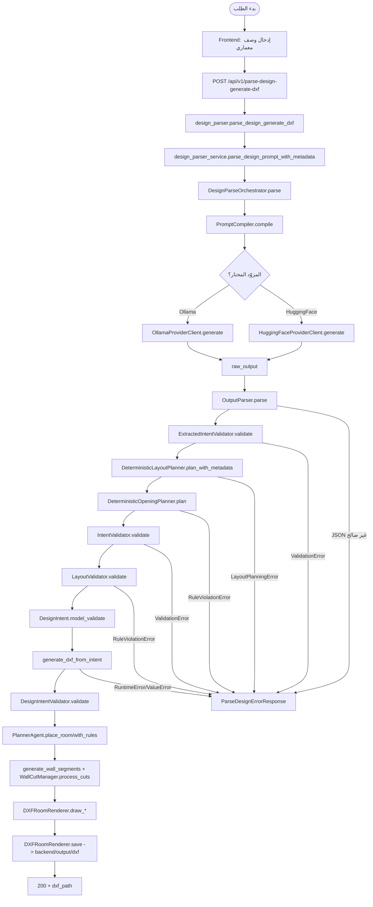

# 01_activity_diagram (تدفق تحويل الوصف إلى DXF) — CadArena

## الغرض
يوضح هذا المخطط النشاطي المسار التشغيلي الكامل لتحويل وصف المستخدم النصي إلى ملف DXF عبر خدمات التحليل والتخطيط والرسم في CadArena.

## المخطط

<!-- VALIDATED: no <<>> inline, no Arabic outside quotes, no reserved keywords as IDs -->

## ملاحظات معمارية
- فصل مسار التحليل (DesignParseOrchestrator) عن مسار الرسم (generate_dxf_from_intent) يقلل التداخل ويبسّط الاختبار.
- التحقق المتكرر (IntentValidator وLayoutValidator وDesignIntentValidator) يحمي خط الرسم من المدخلات غير الصالحة.
- التخطيط الحتمي للأبواب والجدران يعتمد على نفس هندسة الغرف لضمان اتساق القطع قبل الرسم.
