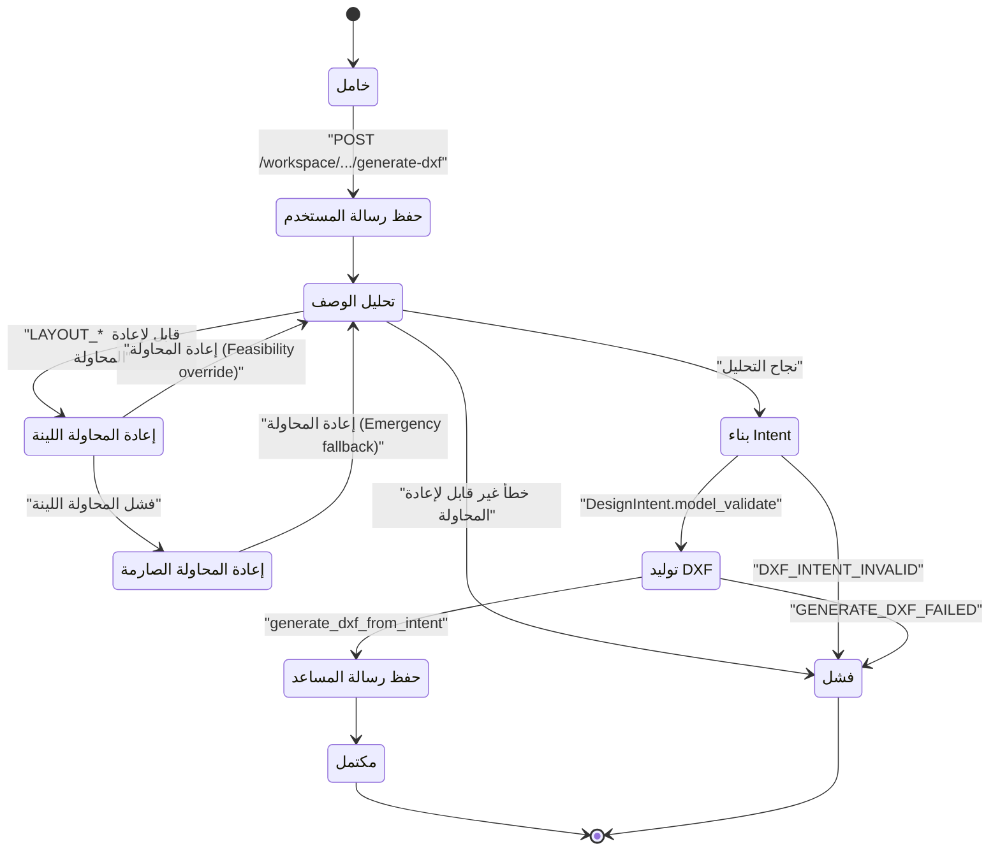

# 02_state_machine_diagram (حالات طلب توليد DXF في workspace) — CadArena

## الغرض
يصف هذا المخطط حالات معالجة طلب توليد DXF في مسار workspace بما في ذلك إعادة المحاولة في حال فشل التخطيط الحتمي.

## المخطط

<!-- VALIDATED: no <<>> inline, no Arabic outside quotes, no reserved keywords as IDs -->

## ملاحظات معمارية
- إعادة المحاولة في workspace تُفعّل فقط لأخطاء التخطيط المحددة في `_LAYOUT_RETRY_CODES` داخل `workspace.py`.
- التحويل إلى `DesignIntent` يتم بعد نجاح التحليل وقبل استدعاء خط DXF لضمان صلاحية النموذج.
- إضافة الرسائل إلى قاعدة البيانات تتم عند البداية والنهاية لتوثيق الحوار حتى في حالات الفشل.
