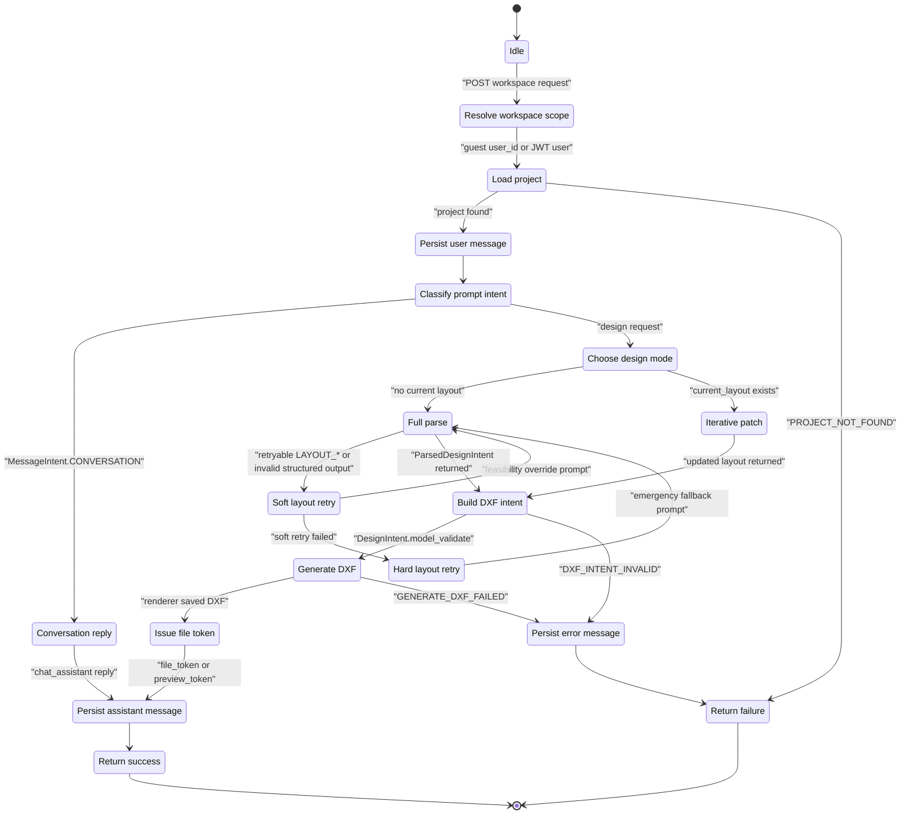

# 02 State Machine Diagram - Workspace Design Request Lifecycle - CadArena

## Purpose
This state machine describes how a workspace design request moves through conversational routing, full generation, iterative editing, retry handling, DXF rendering, persistence, and failure reporting.

## Diagram

## Architectural Notes
- Guest workspace routes receive a `user_id`; authenticated workspace routes derive the user from the JWT cookie and reuse the shared generation function.
- Full generation persists user and assistant messages, while iterative routes return an updated layout and may issue a preview token without exposing a raw path.
- Retry states are limited to layout and structured-output failures that can reasonably be corrected by prompt relaxation or emergency fallback.
- Every terminal path returns a structured payload that the Studio can render as either chat, layout, preview, or error feedback.
