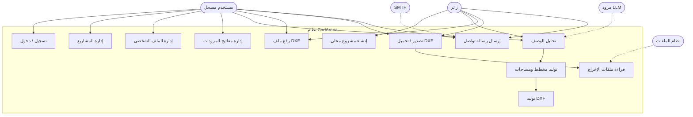

# Use Case Diagram — CadArena

## الغرض
يعرض حالات الاستخدام الأساسية للزوار والمستخدمين المسجلين والخدمات الخارجية.

## المخطط

## ملاحظات معمارية
- مسار الزائر يعتمد على `user_id` محلي، بينما المسجل يعتمد على JWT.
- التحليل يستدعي مزودات خارجية، لكن التخطيط والرسم محليان داخل النظام.
- رفع DXF والتصدير يعتمدان على ملفات `backend/output/`.