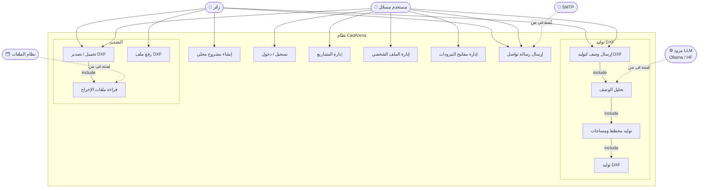

# Use Case Diagram — CadArena

## الغرض
يعرض حالات الاستخدام الأساسية للزوار والمستخدمين المسجلين والخدمات الخارجية.

## المخطط

## ملاحظات معمارية
- مسار الزائر يعتمد على `user_id` محلي في المتصفح، بينما مسار المسجّل يعتمد على JWT عبر `/auth/me`.
- التحليل يستدعي مزودات خارجية (Ollama/HF)، لكن التخطيط والرسم يتمان محلياً داخل `domain/`.
- تصدير DXF/PNG/PDF يتطلب الوصول إلى `backend/output/` وفق `resolve_output_path`.