# 03 Use Case Diagram - CadArena

## Purpose
This use case diagram summarizes the main capabilities currently exposed by CadArena to guests, registered users, and external systems.

## Diagram

```mermaid
flowchart TD
    Guest(["Guest user"])
    Registered(["Registered user"])
    LLM(["LLM providers"])
    SMTP(["SMTP server"])
    Google(["Google OAuth"])
    Files(["Local file storage"])

    subgraph CadArena["CadArena System"]
        UC_BROWSE["Browse public pages and docs"]
        UC_AUTH["Register, login, logout"]
        UC_GOOGLE["Sign in with Google"]
        UC_PROFILE["Manage profile and avatar"]
        UC_PROVIDER_KEYS["Manage provider API keys"]
        UC_PROJECTS["Manage workspace projects"]
        UC_CHAT["Chat with workspace assistant"]
        UC_GENERATE["Generate floor plan from prompt"]
        UC_ITERATE["Refine existing layout iteratively"]
        UC_PREVIEW["Preview DXF output"]
        UC_UPLOAD["Upload external DXF"]
        UC_DOWNLOAD["Download DXF"]
        UC_EXPORT["Export DXF as PNG or PDF"]
        UC_COMMUNITY["Use community Q&A"]
        UC_CONTACT["Send contact message"]
        UC_MODEL_CATALOG["Fetch parse model catalog"]
    end

    Guest --> UC_BROWSE
    Guest --> UC_PROJECTS
    Guest --> UC_CHAT
    Guest --> UC_GENERATE
    Guest --> UC_ITERATE
    Guest --> UC_PREVIEW
    Guest --> UC_UPLOAD
    Guest --> UC_DOWNLOAD
    Guest --> UC_EXPORT
    Guest --> UC_COMMUNITY
    Guest --> UC_CONTACT
    Guest --> UC_MODEL_CATALOG

    Registered --> UC_BROWSE
    Registered --> UC_AUTH
    Registered --> UC_GOOGLE
    Registered --> UC_PROFILE
    Registered --> UC_PROVIDER_KEYS
    Registered --> UC_PROJECTS
    Registered --> UC_CHAT
    Registered --> UC_GENERATE
    Registered --> UC_ITERATE
    Registered --> UC_PREVIEW
    Registered --> UC_UPLOAD
    Registered --> UC_DOWNLOAD
    Registered --> UC_EXPORT
    Registered --> UC_COMMUNITY
    Registered --> UC_CONTACT
    Registered --> UC_MODEL_CATALOG

    UC_GENERATE --> UC_MODEL_CATALOG
    UC_GENERATE --> UC_PREVIEW
    UC_ITERATE --> UC_PREVIEW
    UC_PREVIEW --> UC_EXPORT
    UC_UPLOAD --> UC_PREVIEW

    LLM -.-> UC_GENERATE
    LLM -.-> UC_ITERATE
    SMTP -.-> UC_CONTACT
    Google -.-> UC_GOOGLE
    Files -.-> UC_PREVIEW
    Files -.-> UC_DOWNLOAD
    Files -.-> UC_EXPORT
```

## Architectural Notes
- Guests are supported through a local workspace identity and a guest cookie; registered users use JWT-backed `/workspace/me/*` routes.
- Model-backed use cases call local Ollama, Ollama Cloud/Qwen-compatible, or local HuggingFace providers through the parser service.
- DXF preview, download, and export use file tokens so browser clients do not receive direct server paths.
- Community Q&A supports anonymous display names for guests and authenticated author identity for signed-in users.
