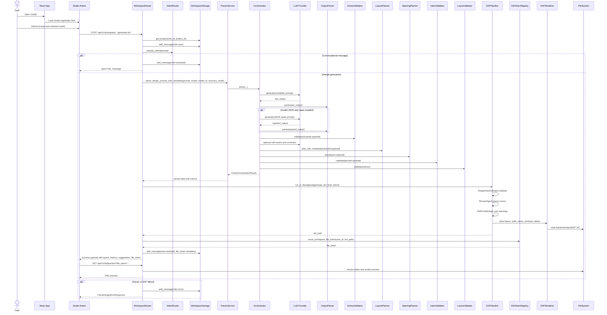

# 04 Sequence Diagram - Workspace DXF Generation - CadArena

## Purpose
This sequence diagram shows the detailed runtime interaction for generating a DXF from a new prompt inside the Studio workspace.

## Diagram

## Architectural Notes
- The workspace router is the transaction coordinator for project lookup, chat persistence, parser invocation, DXF generation, token issuance, and response shaping.
- The parser returns both a strict `ParsedDesignIntent` and layout quality metrics; the router converts only the boundary, rooms, and openings into the DXF-facing `DesignIntent`.
- DXF generation runs in a threadpool so CPU-bound CAD rendering does not block the FastAPI event loop.
- The frontend preview request resolves a token back to a server file and then renders/export it through the DXF routes.
