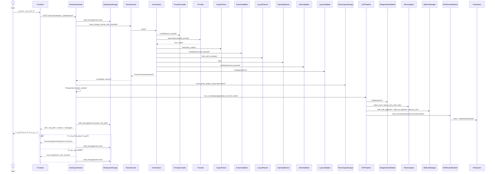

# 04_sequence_diagram (تسلسل توليد DXF من محادثة workspace) — CadArena

## الغرض
يوضح هذا المخطط التسلسلي التفاعل التفصيلي بين الواجهة وخدمات التحليل والتخطيط والرسم عند إنشاء DXF من داخل مساحة العمل.

## المخطط

<!-- VALIDATED: no <<>> inline, no Arabic outside quotes, no reserved keywords as IDs -->

## ملاحظات معمارية
- مسار workspace يضيف رسائل المستخدم والمساعد إلى قاعدة بيانات SQLite لتأمين سجل المحادثة حتى عند الإخفاق.
- التحليل يمر بعدة طبقات تحقق قبل الوصول إلى توليد DXF لمنع إدخال هندسي غير صالح إلى خط الرسم.
- توليد DXF يعمل في threadpool لتجنب حجب حلقة الحدث داخل FastAPI.
