# 05 Communication Diagram - Generation Component Messaging - CadArena

## Purpose
This communication diagram highlights the primary runtime messages among the components involved in project-based generation, iterative editing, preview rendering, and persistence.

## Diagram

```mermaid
flowchart LR
    Browser["Browser"]
    ReactApp["React SPA"]
    Studio["Studio workspace app"]
    AuthApi["auth/profile APIs"]
    WorkspaceRouter["workspace router"]
    DXFRoutes["DXF routes"]
    WorkspaceStorage[("workspace SQLite DB")]
    AuthStorage[("auth/profile SQLite DB")]
    ParserService["design_parser_service"]
    Orchestrator["DesignParseOrchestrator"]
    DiffOrchestrator["run_iterative_design"]
    Provider["ProviderClient"]
    LayoutPlanner["DeterministicLayoutPlanner"]
    OpeningPlanner["DeterministicOpeningPlanner"]
    DXFPipeline["generate_dxf_from_intent"]
    FileTokenRegistry["file_token_registry"]
    Renderer["DXFRoomRenderer and dxf_exporter"]
    OutputFiles[("backend/output")]

    Browser -->|"1: load /studio"| ReactApp
    ReactApp -->|"2: iframe /studio-app/index.html"| Studio
    Studio -->|"3: auth/profile requests"| AuthApi
    AuthApi -->|"3.1: read/write users, profiles, provider keys"| AuthStorage

    Studio -->|"4: list/create/rename/delete projects"| WorkspaceRouter
    WorkspaceRouter -->|"4.1: read/write projects and messages"| WorkspaceStorage

    Studio -->|"5: generate-dxf request"| WorkspaceRouter
    WorkspaceRouter -->|"5.1: persist user message"| WorkspaceStorage
    WorkspaceRouter -->|"5.2: parse prompt"| ParserService
    ParserService -->|"5.2.1: orchestrate extraction and planning"| Orchestrator
    Orchestrator -->|"5.2.2: generate raw text"| Provider
    Orchestrator -->|"5.2.3: plan rooms"| LayoutPlanner
    Orchestrator -->|"5.2.4: place openings"| OpeningPlanner
    WorkspaceRouter -->|"5.3: render CAD file"| DXFPipeline
    DXFPipeline -->|"5.3.1: draw/save"| Renderer
    Renderer -->|"5.3.2: write DXF/PNG/PDF"| OutputFiles
    WorkspaceRouter -->|"5.4: issue token"| FileTokenRegistry
    WorkspaceRouter -->|"5.5: persist assistant or error message"| WorkspaceStorage
    WorkspaceRouter -->|"5.6: response"| Studio

    Studio -->|"6: iterative edit"| WorkspaceRouter
    WorkspaceRouter -->|"6.1: run patch or full-parse fallback"| DiffOrchestrator
    DiffOrchestrator -->|"6.2: optional full parse"| ParserService
    WorkspaceRouter -->|"6.3: optional preview DXF"| DXFPipeline

    Studio -->|"7: preview/download/export/upload DXF"| DXFRoutes
    DXFRoutes -->|"7.1: resolve token"| FileTokenRegistry
    DXFRoutes -->|"7.2: read/write files"| OutputFiles
    DXFRoutes -->|"7.3: render export"| Renderer
```

## Architectural Notes
- The browser-facing Studio app does not call parser internals directly; it talks to route-level APIs that own validation, persistence, and token security.
- `DesignParseOrchestrator` coordinates extraction and deterministic planning, while `run_iterative_design` handles layout edits after the first generated layout exists.
- Workspace metadata and auth/profile data are stored separately, but both are initialized in the FastAPI lifespan.
- File tokens form the communication boundary between API responses and server-side DXF/preview files.
