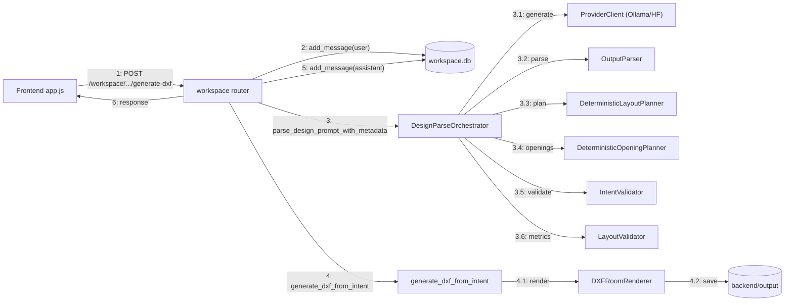

# 05_communication_diagram (تبادل الرسائل بين مكوّنات التوليد) — CadArena

## الغرض
يبرز هذا المخطط عناصر التفاعل الأساسية والرسائل المتبادلة بينها عند تنفيذ توليد DXF في مسار workspace.

## المخطط

<!-- VALIDATED: no <<>> inline, no Arabic outside quotes, no reserved keywords as IDs -->

## ملاحظات معمارية
- التواصل مركزي عبر `workspace_generate_dxf` الذي ينسق كل المكونات دون أن يكشف تفاصيل داخلية للواجهة.
- DesignParseOrchestrator يجمع التخطيط والتحقق ضمن نقطة واحدة لتقليل التشتت بين الخدمات.
- تخزين الملفات منفصل عن التخزين النصي للمحادثات لتبسيط التحكم في الأمان والمسارات.
