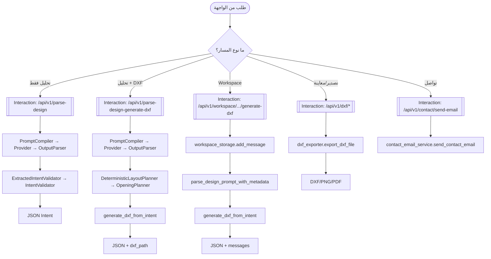

# 06_interaction_overview_diagram (نظرة شاملة لتفاعلات المسارات الأساسية) — CadArena

## الغرض
يقدم هذا المخطط نظرة عالية المستوى لمسارات التفاعل المختلفة في CadArena، مع ربط كل مسار بتفاعل تفصيلي محدد.

## المخطط

<!-- VALIDATED: no <<>> inline, no Arabic outside quotes, no reserved keywords as IDs -->

## ملاحظات معمارية
- تفاعل parse-only يعيد JSON منظم بدون توليد DXF، ما يسمح باستعماله في أدوات خارجية.
- مسار workspace يضيف طبقة حفظ الرسائل والمشاريع قبل وبعد التحليل لضمان الاستمرارية.
- مسار التصدير يستخدم dxf_exporter مع `resolve_output_path` لضمان الوصول الآمن للملفات.
