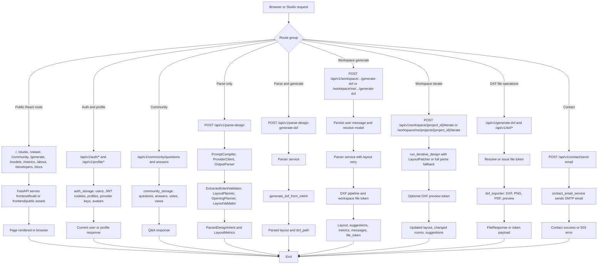

# 06 Interaction Overview Diagram - Main Runtime Flows - CadArena

## Purpose
This interaction overview links the main user-visible routes to the backend workflows that implement them.

## Diagram

## Architectural Notes
- The same parser core powers the standalone parse routes, workspace generation, and iterative full-parse fallback.
- Workspace generation adds project/message persistence and tokenized file access around the parser and DXF pipeline.
- DXF file operations are isolated under `/api/v1/dxf/*`, which keeps upload, preview, download, and export behavior consistent across Studio and Viewer.
- The backend also serves the frontend when a production build exists, while still supporting public assets and the embedded Studio app in development.
