# 07 Timing Diagram - Single Workspace Generation Request - CadArena

## Purpose
This timing diagram shows the ordered phases of a single full-generation request from prompt submission to preview rendering.

## Diagram

```mermaid
timeline
    title CadArena workspace generation timing
    section Browser and Studio
      T0: User opens /studio and selects a project
      T1: Studio loads model catalog from /api/v1/parse-design-models
      T2: User submits prompt and model choice
      T3: Studio sends POST /workspace/.../generate-dxf
    section Workspace Router
      T4: Resolve guest or authenticated workspace scope
      T5: Load project and persist user message
      T6: Classify prompt as conversation or design request
    section Parser Service
      T7: Normalize prompt and compile provider prompt
      T8: Provider generates raw extraction output
      T9: Parse or repair JSON output
      T10: Validate extracted intent and run self-review
      T11: Plan deterministic layout and openings
      T12: Validate intent and calculate layout metrics
    section DXF Pipeline
      T13: Convert parsed payload to DesignIntent
      T14: Validate rooms, boundary, openings
      T15: Place rooms and generate wall segments
      T16: Cut doors/windows and render DXF layers
      T17: Save DXF under backend/output/dxf
    section Persistence and Preview
      T18: Issue workspace file token
      T19: Persist assistant message with file metadata
      T20: Return layout, suggestions, metrics, and file token
      T21: Studio requests /api/v1/dxf/preview
      T22: Backend exports PNG preview and browser displays it
```

## Architectural Notes
- Parser and planner stages run sequentially because each stage depends on validated geometry from the previous stage.
- Provider latency dominates many requests, while deterministic planning and DXF rendering remain local backend work.
- The DXF file is saved before the assistant message is persisted, so returned file tokens point to an existing artifact.
- Preview rendering is a separate follow-up request, which lets generation finish even if PNG/PDF export dependencies are unavailable.
