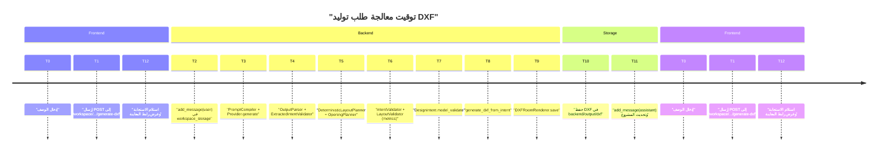

# 07_timing_diagram (توقيت مراحل التوليد في الطلب الواحد) — CadArena

## الغرض
يوضح هذا المخطط توقيت المراحل الرئيسة لمعالجة طلب توليد DXF من لحظة الإرسال حتى حفظ الملف والاستجابة.

## المخطط

<!-- VALIDATED: no <<>> inline, no Arabic outside quotes, no reserved keywords as IDs -->

## ملاحظات معمارية
- خطوات التحليل والتخطيط تسبق توليد DXF ولا تُنفذ بالتوازي لضمان صحة الهندسة.
- التوقيت الفعلي يعتمد على مزود LLM وحجم البرنامج، لكن ترتيب المراحل ثابت كما في التسلسل أعلاه.
- حفظ الملف يأتي قبل تحديث رسالة المساعد لضمان أن رابط `dxf_path` يشير إلى ملف موجود.
