# 08 Class Diagram - Core Backend Types and Services - CadArena

## Purpose
This class diagram captures the main types involved in prompt parsing, deterministic layout generation, iterative layout editing, DXF rendering, tokenized file access, and workspace persistence.

## Diagram

```mermaid
classDiagram
    class WorkspaceRouter {
        +workspace_generate_dxf(project_id, request, response)
        +iterate_design(project_id, body, request)
        +iterate_design_authenticated(project_id, body, request, current_user)
    }

    class DesignParseOrchestrator {
        -_prompt_compiler
        -_output_parser
        -_extracted_intent_validator
        -_prompt_program_deriver
        -_layout_planner
        -_opening_planner
        -_layout_validator
        -_intent_validator
        -_providers
        +startup()
        +shutdown()
        +parse(prompt, model_choice, recovery_mode, request_id)
    }

    class PromptCompiler {
        +compile(user_prompt)
    }
    class OutputParser {
        +parse(raw_output)
    }
    class ExtractedIntentValidator {
        +validate(payload, prompt)
    }
    class PromptProgramDeriver {
        +derive(prompt, extracted_payload)
    }
    class DeterministicLayoutPlanner {
        +plan(extracted_payload, optimize_efficiency)
        +plan_with_metadata(extracted_payload)
        +normalize_layout(layout)
    }
    class DeterministicOpeningPlanner {
        +plan(extracted_payload, layout_payload)
    }
    class IntentValidator {
        +validate(payload)
    }
    class LayoutValidator {
        +validate(extracted_payload, planned_payload, selected_topology)
    }

    class LLMProviderPort {
        <<interface>>
        +startup()
        +shutdown()
        +generate(compiled_prompt, request_id)
    }
    class ProviderClient
    class OllamaProviderClient
    class QwenCloudProviderClient
    class HuggingFaceProviderClient

    class LayoutPatcher {
        +apply(current, diff)
    }
    class DiffOrchestrator {
        +run_iterative_design(user_prompt, current_layout, project_id, model_choice, recovery_mode)
    }

    class DesignIntent {
        +boundary: BoundaryIntent
        +rooms: RoomIntent[]
        +openings: OpeningIntent[]
    }
    class ParsedDesignIntent {
        +boundary
        +rooms
        +walls
        +openings
    }
    class LayoutMetrics {
        +area_balance
        +zoning
        +circulation
        +daylight
        +structural
        +furniture
        +efficiency
        +total_score
        +selected_topology
    }
    class RoomIntent
    class OpeningIntent
    class BoundaryIntent
    class Point
    class RectangleGeometry
    class Room

    class DesignIntentValidator {
        +validate(intent)
    }
    class PlannerAgent {
        +place_room(room)
        +place_room_with_rules(room, rules)
    }
    class BoundaryConstraint
    class OverlapConstraint
    class SpacingConstraint
    class WallSegment {
        +length()
    }
    class WallCutManager {
        +add_wall_segments(segments)
        +add_cut_segment(cut_start, cut_end, wall, allow_shared)
        +process_cuts()
    }
    class DoorSpec
    class DoorPlacement
    class DoorGeometry
    class DXFRoomRenderer {
        +draw_boundary_segments(lines)
        +draw_wall_segments(lines)
        +draw_window_segment(start, end)
        +draw_door_geometry(geom)
        +draw_room_label(text, position, room_type)
        +draw_room_dimensions(text, position)
        +save()
    }

    class WorkspaceStorage {
        +create_project(user_id, name)
        +list_projects(user_id)
        +add_message(user_id, project_id, role, text)
    }
    class FileTokenRegistry {
        +issue_session_file_token(request, response, absolute_path)
        +issue_workspace_file_token(user_id, absolute_path)
        +resolve_request_file_token(request, file_token)
    }

    WorkspaceRouter ..> WorkspaceStorage
    WorkspaceRouter ..> DesignParseOrchestrator
    WorkspaceRouter ..> DiffOrchestrator
    WorkspaceRouter ..> DesignIntent
    WorkspaceRouter ..> FileTokenRegistry

    DesignParseOrchestrator *-- PromptCompiler
    DesignParseOrchestrator *-- OutputParser
    DesignParseOrchestrator *-- ExtractedIntentValidator
    DesignParseOrchestrator *-- PromptProgramDeriver
    DesignParseOrchestrator *-- DeterministicLayoutPlanner
    DesignParseOrchestrator *-- DeterministicOpeningPlanner
    DesignParseOrchestrator *-- IntentValidator
    DesignParseOrchestrator *-- LayoutValidator
    DesignParseOrchestrator ..> ProviderClient
    DesignParseOrchestrator ..> ParsedDesignIntent
    DesignParseOrchestrator ..> LayoutMetrics

    ProviderClient ..|> LLMProviderPort
    OllamaProviderClient --|> ProviderClient
    QwenCloudProviderClient --|> OllamaProviderClient
    HuggingFaceProviderClient --|> ProviderClient

    DiffOrchestrator ..> LayoutPatcher
    DiffOrchestrator ..> DesignParseOrchestrator

    DesignIntent *-- BoundaryIntent
    DesignIntent *-- RoomIntent
    DesignIntent *-- OpeningIntent
    RoomIntent --> Point
    RectangleGeometry --> Point
    Room --> Point

    DesignIntentValidator ..> DesignIntent
    PlannerAgent *-- BoundaryConstraint
    PlannerAgent *-- OverlapConstraint
    PlannerAgent *-- SpacingConstraint
    PlannerAgent --> RectangleGeometry
    PlannerAgent --> Room

    WallCutManager *-- WallSegment
    DoorPlacement *-- DoorSpec
    DoorPlacement --> WallSegment
    DoorGeometry ..> DoorPlacement
    DXFRoomRenderer ..> DoorGeometry
    DXFRoomRenderer ..> Point
```

## Architectural Notes
- The parser uses strict contracts (`ExtractedDesignIntent`, `ParsedDesignIntent`, and `LayoutMetrics`) before the DXF-facing `DesignIntent` is built.
- `QwenCloudProviderClient` extends the Ollama-compatible provider implementation because cloud models use a chat-compatible Ollama endpoint shape.
- Iterative editing is intentionally separated through `run_iterative_design` and `LayoutPatcher`, while full generation continues through `DesignParseOrchestrator`.
- Rendering classes stay in the domain and service layers; routers only coordinate requests, persistence, and response payloads.
