# 08_class_diagram (العلاقات بين الكيانات والخدمات الأساسية) — CadArena

## الغرض
يوضح هذا المخطط العلاقات بين أهم الأصناف والخدمات المستخدمة في مسارات التحليل الحتمي وتوليد DXF داخل CadArena.

## المخطط

```mermaid
classDiagram
    class DesignParseOrchestrator {
        +startup()
        +shutdown()
        +parse(prompt, model_choice, recovery_mode, request_id)
    }
    class PromptCompiler {
        +compile(user_prompt)
    }
    class OutputParser {
        +parse(raw_output)
    }
    class ExtractedIntentValidator {
        +validate(payload)
    }
    class PromptProgramDeriver {
        +derive(prompt, extracted_payload)
    }
    class DeterministicLayoutPlanner {
        +plan_with_metadata(extracted_payload)
    }
    class DeterministicOpeningPlanner {
        +plan(extracted_payload, layout_payload)
    }
    class IntentValidator {
        +validate(payload)
    }
    class LayoutValidator {
        +validate(extracted_payload, planned_payload)
    }

    class LLMProviderPort {
        <<interface>>
        +startup()
        +shutdown()
        +generate(compiled_prompt, request_id)
    }
    class ProviderClient
    class OllamaProviderClient
    class HuggingFaceProviderClient

    class IntentToAgentPipeline {
        +generate_dxf_from_intent(intent, planning_context)
    }
    class DesignIntentValidator {
        +validate(intent)
    }
    class PlannerAgent {
        +place_room(room)
        +place_room_with_rules(room, rules)
    }
    class BoundaryConstraint
    class OverlapConstraint
    class SpacingConstraint

    class WallCutManager {
        +add_wall_segments(segments)
        +add_cut_segment(start, end, wall)
        +process_cuts()
    }
    class WallSegment {
        +length()
    }
    class DoorSpec
    class DoorPlacement
    class DoorGeometry
    class DXFRoomRenderer {
        +draw_boundary_segments()
        +draw_wall_segments()
        +draw_door_geometry()
        +draw_window_segment()
        +save()
    }

    class DesignIntent {
        +boundary: BoundaryIntent
        +rooms: RoomIntent[]
        +openings: OpeningIntent[]
    }
    class BoundaryIntent
    class RoomIntent
    class OpeningIntent
    class RectangleGeometry
    class Room
    class Point

    DesignParseOrchestrator *-- PromptCompiler
    DesignParseOrchestrator *-- OutputParser
    DesignParseOrchestrator *-- ExtractedIntentValidator
    DesignParseOrchestrator *-- PromptProgramDeriver
    DesignParseOrchestrator *-- DeterministicLayoutPlanner
    DesignParseOrchestrator *-- DeterministicOpeningPlanner
    DesignParseOrchestrator *-- IntentValidator
    DesignParseOrchestrator *-- LayoutValidator
    DesignParseOrchestrator ..> ProviderClient

    ProviderClient ..|> LLMProviderPort
    OllamaProviderClient --|> ProviderClient
    HuggingFaceProviderClient --|> ProviderClient

    IntentToAgentPipeline ..> DesignIntentValidator
    IntentToAgentPipeline ..> PlannerAgent
    IntentToAgentPipeline ..> WallCutManager
    IntentToAgentPipeline ..> DXFRoomRenderer

    PlannerAgent *-- BoundaryConstraint
    PlannerAgent *-- OverlapConstraint
    PlannerAgent *-- SpacingConstraint
    PlannerAgent --> RectangleGeometry
    PlannerAgent --> Room

    DoorPlacement *-- DoorSpec
    DoorPlacement --> WallSegment
    DoorGeometry ..> DoorPlacement
    WallCutManager *-- WallSegment

    DXFRoomRenderer ..> DoorGeometry
    DXFRoomRenderer ..> Point

    DesignIntent *-- BoundaryIntent
    DesignIntent *-- RoomIntent
    DesignIntent *-- OpeningIntent
    RoomIntent --> Point
```

<!-- VALIDATED: no <<>> inline, no Arabic outside quotes, no reserved keywords as IDs -->

## ملاحظات معمارية
- تمت نمذجة `IntentToAgentPipeline` كعنصر تجميعي لأنه يجمع عدداً من الوحدات الوظيفية في `intent_to_agent.py`.
- التوريث بين `ProviderClient` و`LLMProviderPort` يعكس اعتماد منظومة التحليل على منفذ موحّد للمزوّدات.
- فصل نماذج Pydantic (`DesignIntent` وما تحتها) عن كيانات المجال (`Room`, `RectangleGeometry`) يحافظ على استقلالية المنطق الهندسي.
