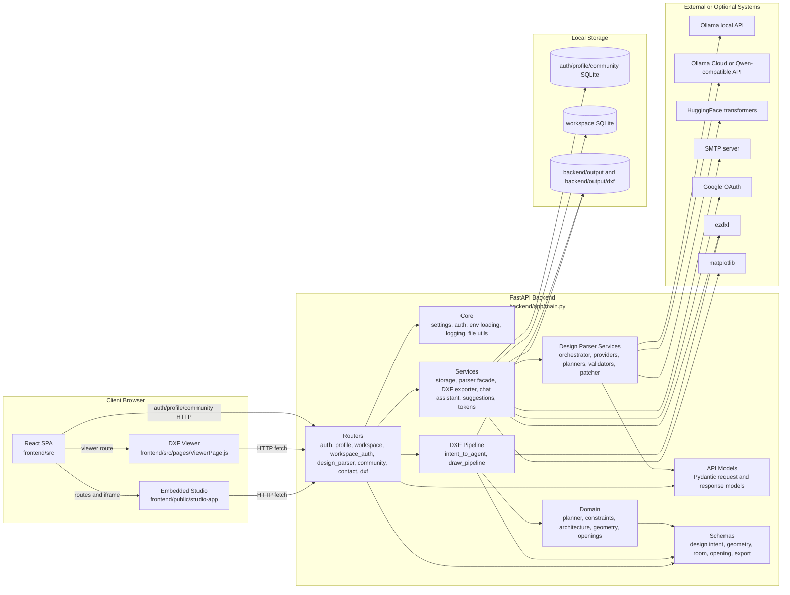

# 09 Component Diagram - Main Components and Dependencies - CadArena

## Purpose
This component diagram shows the major deployable and logical components in the current CadArena repository and how they depend on each other.

## Diagram

## Architectural Notes
- `backend/app/main.py` mounts frontend assets when available and registers all `/api/v1` routers.
- The Studio workspace is a legacy static app embedded by the React `/studio` route, but it uses the same backend APIs as the rest of the React application.
- Parser providers are optional at runtime; missing CAD dependencies disable DXF routes rather than preventing the whole app from importing.
- SQLite databases and generated files live on the backend host and are initialized or cleaned up through startup tasks.
