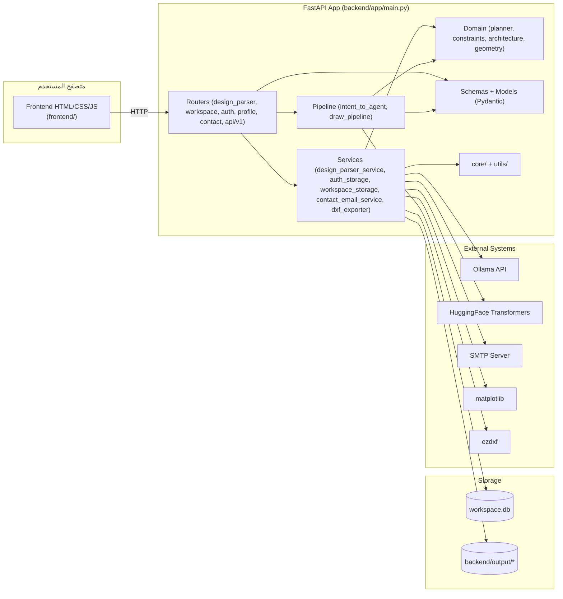

# 09_component_diagram (المكوّنات الرئيسية والاعتماديات) — CadArena

## الغرض
يوضح هذا المخطط المكوّنات الأساسية في CadArena وكيف تتبادل البيانات مع بعضها ومع الأنظمة الخارجية.

## المخطط

<!-- VALIDATED: no <<>> inline, no Arabic outside quotes, no reserved keywords as IDs -->

## ملاحظات معمارية
- الواجهة الأمامية ثابتة وتُخدم مباشرة عبر FastAPI دون بناء، لذلك تعتمد كل الواجهات على المسارات HTTP نفسها.
- الاعتماد على `ezdxf` داخل خط الرسم يجعل توليد DXF محلياً ومحدداً بإصدارات المكتبة.
- التصدير إلى PDF/PNG يمر عبر `matplotlib` مع مسار بديل في حال غياب الاعتماديات.
