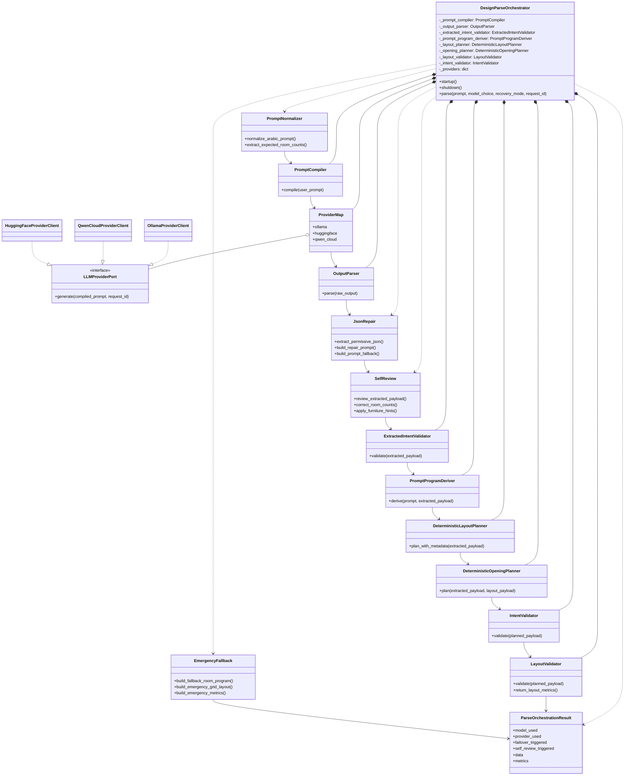

# 10 Composite Structure Diagram - DesignParseOrchestrator Internals - CadArena

## Purpose
This composite structure diagram shows the internal parts of `DesignParseOrchestrator` and the order in which those parts collaborate to produce a validated layout.

## Diagram

## Architectural Notes
- The orchestrator owns long-lived component instances and coordinates them in a fixed pipeline.
- Provider selection is request-scoped for model overrides, while the stable provider map remains inside the singleton parser service.
- JSON repair, self-review, quality correction, and emergency fallback are internal recovery responsibilities rather than separate routers.
- The final result includes both validated geometry and layout metrics so callers can render or explain the generated plan.
