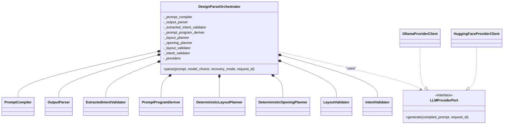

# 10_composite_structure_diagram (البنية الداخلية لـ DesignParseOrchestrator) — CadArena

## الغرض
يعرض هذا المخطط البنية الداخلية لمكوّن التحليل الحتمي DesignParseOrchestrator والعلاقات بين مكوناته الفرعية.

## المخطط

<!-- VALIDATED: no <<>> inline, no Arabic outside quotes, no reserved keywords as IDs -->

## ملاحظات معمارية
- المكوّن يستخدم تجميعاً صريحاً (composition) لعناصر التخطيط والتحقق لضمان ثبات سلسلة المعالجة.
- واجهة `LLMProviderPort` تسمح بتبديل المزود دون تغيير طبقات التخطيط أو التحقق.
- المزوّدات تُدار في قاموس داخلي مرتبط بقيمة `ParseDesignModel` مما يسهل التوسعة لاحقاً.
