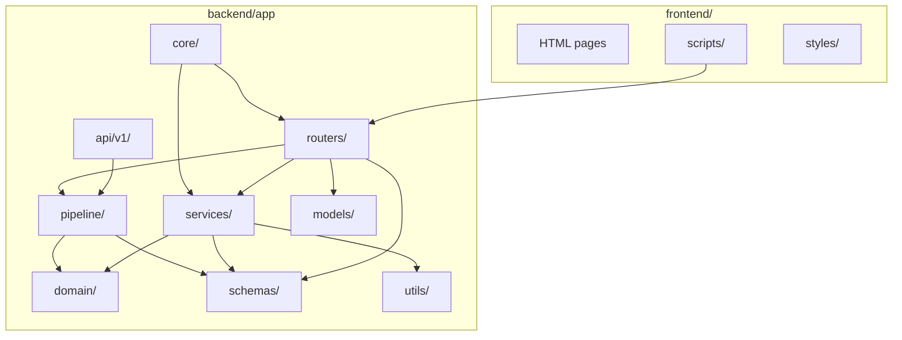

# 11_package_diagram (تقسيم الحزم داخل المشروع) — CadArena

## الغرض
يوضح هذا المخطط تقسيم الحزم الداخلية في CadArena وتدفقات الاعتماد بين الطبقات المختلفة.

## المخطط

<!-- VALIDATED: no <<>> inline, no Arabic outside quotes, no reserved keywords as IDs -->

## ملاحظات معمارية
- `routers/` تبقي النقل (HTTP) منفصلاً عن المنطق وتستدعي `services/` و`pipeline/` عند الحاجة.
- `domain/` يحتوي المنطق الهندسي والقيود ويُستهلك من الخدمات وخط الرسم دون الاعتماد على FastAPI.
- الواجهة الأمامية تعتمد على المسارات التي يقدمها `routers/` وتستخدمها عبر `fetch` داخل `frontend/scripts/app.js`.
