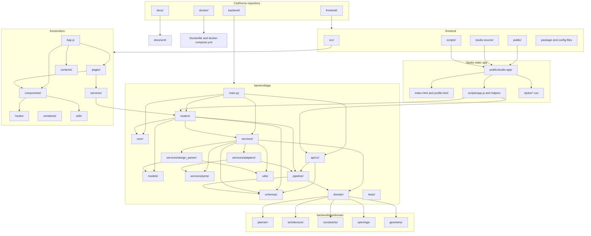

# 11 Package Diagram - Repository Package Structure - CadArena

## Purpose
This package diagram shows the current package layout across the backend, React frontend, embedded Studio source, tests, documentation, and Docker setup.

## Diagram

## Architectural Notes
- Backend transport concerns live in `routers/` and `api/v1/`; domain geometry and planner rules stay under `domain/`.
- `services/design_parser/` contains the high-level LLM extraction and deterministic planning pipeline, while `pipeline/intent_to_agent.py` converts validated intent into DXF geometry.
- The React app owns routing, authentication context, page shells, and the Viewer; the full Studio workspace is currently served as static HTML/CSS/JS.
- `frontend/scripts/copy-studio.js` keeps `studio-source/` and `public/studio-app/` aligned for the embedded workspace.
