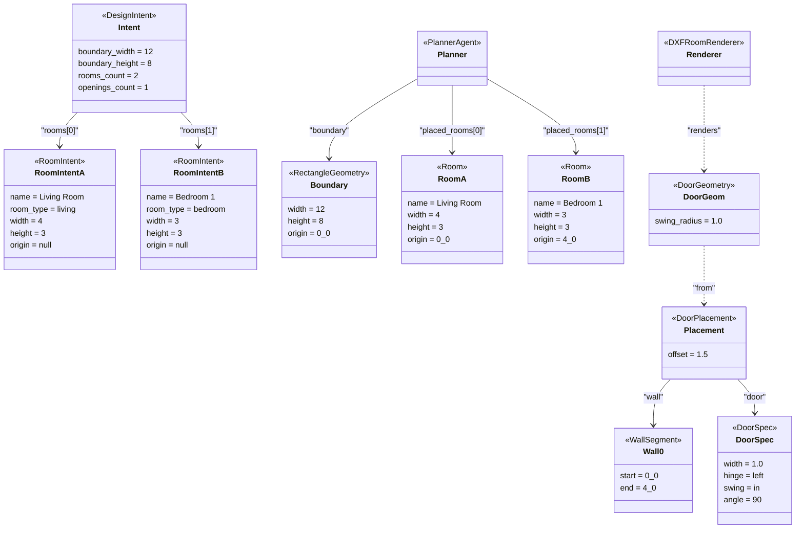

# Object Diagram (لقطة كائنات أثناء توليد DXF) — CadArena

## الغرض
يعرض لقطة آنية لكائنات فعلية أثناء معالجة طلب توليد DXF، مع قيم نموذجية مشتقة من مسار التنفيذ الحقيقي.

## المخطط

## ملاحظات معمارية
- `RoomIntent` تمثل المدخلات، بينما `Room` تمثل الكيانات الموضوعة بعد التخطيط داخل `PlannerAgent`.
- `DoorPlacement` يربط الباب بجدار محدد عبر `WallSegment` قبل حساب `DoorGeometry`.
- قيم الأصول في المثال تتوافق مع منطق التخطيط الشبكي في `PlannerAgent`.