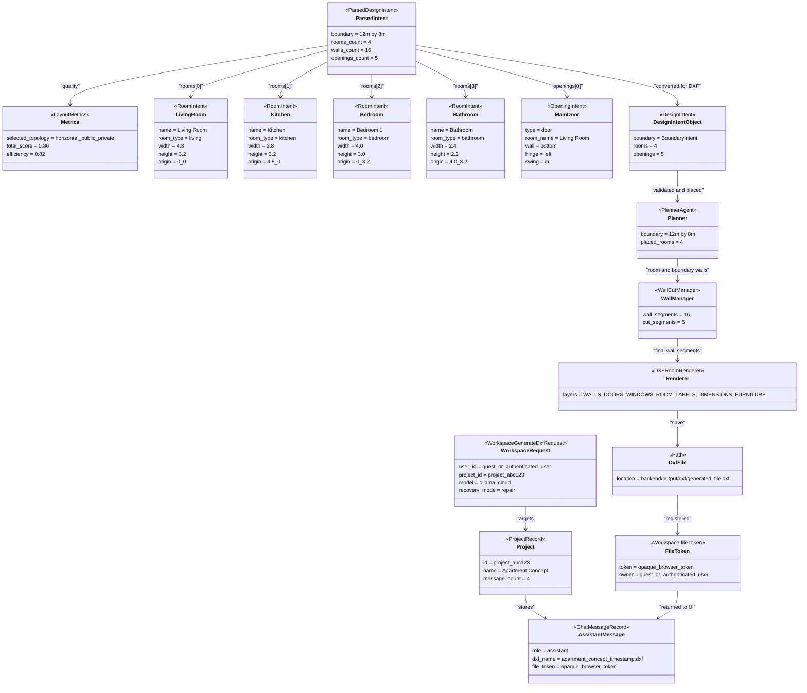

# 12 Object Diagram - Runtime Snapshot During DXF Generation - CadArena

## Purpose
This object diagram shows a representative runtime snapshot after the parser has produced a validated layout and before the backend returns a workspace generation response.

## Diagram

## Architectural Notes
- The parser-facing `ParsedDesignIntent` includes explicit walls and metrics; the renderer-facing `DesignIntent` uses only boundary, rooms, and openings.
- `PlannerAgent` still validates placement even when the parser has already produced explicit room origins.
- `WallCutManager` owns the final wall gaps for doors and windows before `DXFRoomRenderer` writes CAD layers.
- The stored assistant message keeps user-facing file metadata and a token, not the raw absolute path.
