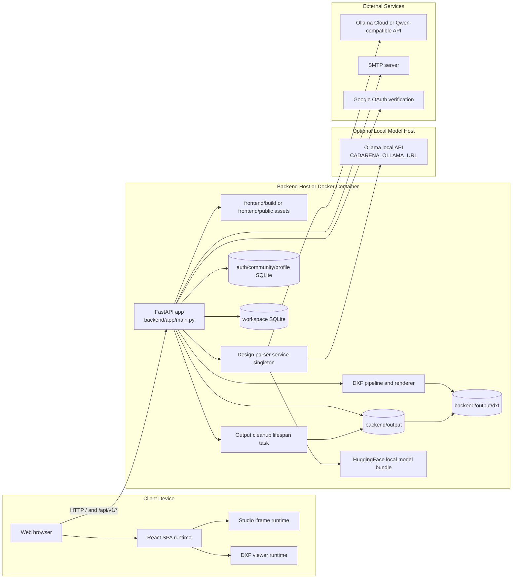

# 13 Deployment Diagram - Runtime Topology - CadArena

## Purpose
This deployment diagram shows where CadArena components run in local or containerized development, including browser assets, FastAPI, local databases, generated files, model providers, and optional external services.

## Diagram

## Architectural Notes
- The backend serves both API routes and frontend assets when the build or public asset folders exist.
- Local SQLite databases and generated files are colocated with the backend process; Docker deployment preserves the same logical topology.
- HuggingFace runs in-process through Python dependencies, while Ollama can be a local server or cloud-compatible endpoint.
- Contact email and Google sign-in are optional external integrations controlled by environment configuration.
