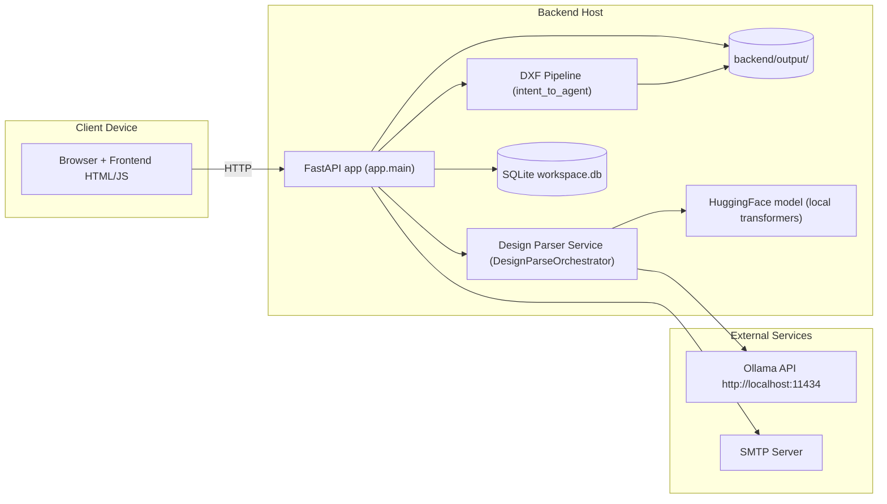

# 13_deployment_diagram (نشر المكوّنات وبيئات التشغيل) — CadArena

## الغرض
يوضح هذا المخطط مواقع تشغيل المكونات الأساسية في CadArena وعلاقات الاتصال بينها أثناء التشغيل الفعلي.

## المخطط

<!-- VALIDATED: no <<>> inline, no Arabic outside quotes, no reserved keywords as IDs -->

## ملاحظات معمارية
- مزود Ollama يُستدعى عبر HTTP بينما مزود HuggingFace يعمل محلياً داخل نفس المضيف عبر مكتبات Python.
- الملفات الناتجة تحفظ على نظام الملفات المحلي وتُخدم لاحقاً عبر مسارات `/api/v1/dxf/*`.
- قاعدة بيانات SQLite مدمجة ضمن نفس المضيف وتستخدمها وحدات `auth_storage` و`workspace_storage`.
