# 14 Profile Diagram - Architectural Stereotypes - CadArena

## Purpose
This profile diagram defines the architectural stereotypes used to classify CadArena elements across transport, application services, domain logic, storage, adapters, ports, UI, and external integrations.

## Diagram

```mermaid
classDiagram
    class ReactApp {
        <<UI>>
    }
    class StudioApp {
        <<UI>>
    }
    class ViewerPage {
        <<UI>>
    }

    class AuthRouter {
        <<Router>>
    }
    class ProfileRouter {
        <<Router>>
    }
    class WorkspaceRouter {
        <<Router>>
    }
    class DesignParserRouter {
        <<Router>>
    }
    class CommunityRouter {
        <<Router>>
    }
    class DXFRoutes {
        <<Router>>
    }

    class DesignParseOrchestrator {
        <<Service>>
    }
    class WorkspaceStorageService {
        <<Service>>
    }
    class CommunityStorageService {
        <<Service>>
    }
    class ContactEmailService {
        <<Service>>
    }
    class DxfExporter {
        <<Service>>
    }
    class FileTokenRegistry {
        <<Service>>
    }

    class PlannerAgent {
        <<Domain>>
    }
    class WallCutManager {
        <<Domain>>
    }
    class DoorGeometry {
        <<Domain>>
    }
    class BoundaryConstraint {
        <<Domain>>
    }

    class AuthDatabase {
        <<Storage>>
    }
    class WorkspaceDatabase {
        <<Storage>>
    }
    class CommunityDatabase {
        <<Storage>>
    }
    class OutputDirectory {
        <<Storage>>
    }

    class LLMProviderPort {
        <<Port>>
    }
    class DXFGeneratorPort {
        <<Port>>
    }

    class PipelineDXFGenerator {
        <<Adapter>>
    }
    class OllamaProviderClient {
        <<Adapter>>
    }
    class QwenCloudProviderClient {
        <<Adapter>>
    }
    class HuggingFaceProviderClient {
        <<Adapter>>
    }

    class OllamaAPI {
        <<External>>
    }
    class HuggingFaceRuntime {
        <<External>>
    }
    class SMTPServer {
        <<External>>
    }
    class GoogleOAuth {
        <<External>>
    }

    ReactApp --> StudioApp : "embeds"
    ReactApp --> ViewerPage : "routes"
    StudioApp ..> WorkspaceRouter : "calls"
    StudioApp ..> DXFRoutes : "calls"
    ViewerPage ..> DXFRoutes : "calls"
    ReactApp ..> AuthRouter : "calls"
    ReactApp ..> ProfileRouter : "calls"
    ReactApp ..> CommunityRouter : "calls"

    WorkspaceRouter ..> DesignParseOrchestrator : "uses"
    WorkspaceRouter ..> WorkspaceStorageService : "persists"
    WorkspaceRouter ..> FileTokenRegistry : "issues tokens"
    DesignParserRouter ..> DesignParseOrchestrator : "uses"
    CommunityRouter ..> CommunityStorageService : "persists"
    DXFRoutes ..> DxfExporter : "exports"
    DXFRoutes ..> FileTokenRegistry : "resolves tokens"
    ProfileRouter ..> AuthDatabase : "stores profile data"
    AuthRouter ..> AuthDatabase : "stores credentials"

    DesignParseOrchestrator ..> LLMProviderPort : "depends on"
    OllamaProviderClient ..|> LLMProviderPort
    QwenCloudProviderClient ..|> LLMProviderPort
    HuggingFaceProviderClient ..|> LLMProviderPort
    OllamaProviderClient ..> OllamaAPI : "HTTP"
    QwenCloudProviderClient ..> OllamaAPI : "cloud HTTP"
    HuggingFaceProviderClient ..> HuggingFaceRuntime : "local model"

    PipelineDXFGenerator ..|> DXFGeneratorPort
    PipelineDXFGenerator ..> PlannerAgent : "places rooms"
    PipelineDXFGenerator ..> WallCutManager : "cuts walls"
    PipelineDXFGenerator ..> DoorGeometry : "computes doors"
    PlannerAgent ..> BoundaryConstraint : "validates"
    DxfExporter ..> OutputDirectory : "reads and writes"
    FileTokenRegistry ..> OutputDirectory : "binds tokens"
    WorkspaceStorageService ..> WorkspaceDatabase : "reads and writes"
    CommunityStorageService ..> CommunityDatabase : "reads and writes"
    ContactEmailService ..> SMTPServer : "sends"
    AuthRouter ..> GoogleOAuth : "verifies"
```

## Architectural Notes
- `Router` elements own HTTP contracts and request/response shaping; `Service` elements coordinate business workflows and persistence.
- `Domain` elements contain geometry, planning, opening, and validation logic that can be tested without FastAPI.
- `Port` and `Adapter` stereotypes document replaceable integration boundaries, especially for LLM providers and DXF generation.
- `UI` elements are split between the React application, the embedded Studio workspace, and the React DXF Viewer.
