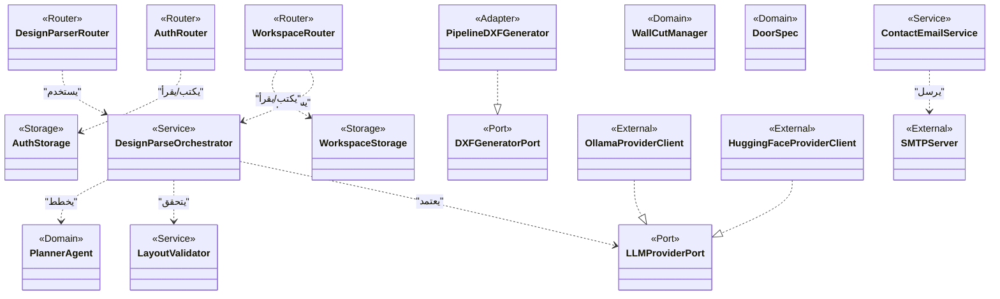

# 14_profile_diagram (بروفايل الستيريотипات لطبقات النظام) — CadArena

## الغرض
يعرض هذا المخطط البروفايل المعماري المستخدم لتصنيف العناصر داخل CadArena عبر ستيريотипات واضحة (Router/Service/Domain/Storage/Port/Adapter/External).

## المخطط

<!-- VALIDATED: no <<>> inline, no Arabic outside quotes, no reserved keywords as IDs -->

## ملاحظات معمارية
- الستيريотипات تعكس الطبقات الفعلية في الشيفرة: routers كطبقة نقل، services كتنسيق، domain كمنطق هندسي، وstorage كطبقة SQLite/ملفات.
- اعتماد الخدمات على منافذ (Ports) يقلل الارتباط المباشر بالمزوّدات الخارجية ويتيح استبدالها.
- وجود Adapter مثل `PipelineDXFGenerator` يربط المنافذ بخط الرسم الحالي دون تغيير واجهات الاستخدام.
