# 01 Activity Diagram - Workspace, RAG, and DXF Workflow - CadArena

## Purpose
This activity diagram documents the current workflows for workspace design generation, RAG-backed architecture chat, and DXF preview. The diagram is written in valid Mermaid syntax and uses English labels for academic documentation.

## Diagram

```mermaid
flowchart TD
    START([Start]) --> ENTRY_FLOW{User workflow}

    ENTRY_FLOW -->|Workspace design| AUTH{User session type}
    AUTH -->|Guest workspace| GUEST_SCOPE[Bind workspace guest cookie]
    AUTH -->|Authenticated workspace| AUTH_SCOPE[Resolve JWT authenticated user]
    GUEST_SCOPE --> LOAD_PROJECT[Load workspace project]
    AUTH_SCOPE --> LOAD_PROJECT

    LOAD_PROJECT --> PROJECT_FOUND{Project exists}
    PROJECT_FOUND -->|No| PROJECT_ERROR[Return project not found error]
    PROJECT_FOUND -->|Yes| SAVE_USER_MESSAGE[Persist user message]

    SAVE_USER_MESSAGE --> CLASSIFY_INTENT[Classify prompt intent]
    CLASSIFY_INTENT --> INTENT_KIND{Intent type}

    INTENT_KIND -->|Conversation| CHAT_REPLY[Generate assistant chat reply]
    CHAT_REPLY --> SAVE_CHAT_REPLY[Persist assistant message]
    SAVE_CHAT_REPLY --> CHAT_RESPONSE[Return chat response]

    INTENT_KIND -->|New design| PARSE_REQUEST[Parse design prompt]
    INTENT_KIND -->|Edit existing design| ITERATE_REQUEST[Run iterative design]

    PARSE_REQUEST --> MODEL_SELECT[Select configured parser provider and model]
    MODEL_SELECT --> COMPILE_PROMPT[Compile extraction prompt]
    COMPILE_PROMPT --> PROVIDER_CALL[Call local or cloud model provider]
    PROVIDER_CALL --> PARSE_OUTPUT[Parse model output as structured data]
    PARSE_OUTPUT --> OUTPUT_VALID{Structured output valid}
    OUTPUT_VALID -->|No| REPAIR_OUTPUT[Apply repair or fallback prompt]
    REPAIR_OUTPUT --> PARSE_OUTPUT
    OUTPUT_VALID -->|Yes| VALIDATE_INTENT[Validate extracted intent]

    VALIDATE_INTENT --> DERIVE_PROGRAM[Derive room program from prompt]
    DERIVE_PROGRAM --> PLAN_LAYOUT[Plan deterministic room layout]
    PLAN_LAYOUT --> PLAN_OPENINGS[Plan doors and windows]
    PLAN_OPENINGS --> VALIDATE_LAYOUT[Validate layout metrics and rules]

    VALIDATE_LAYOUT --> LAYOUT_OK{Layout valid}
    LAYOUT_OK -->|No| RETRY_ALLOWED{Retry allowed}
    RETRY_ALLOWED -->|Yes| RELAX_PROMPT[Apply feasibility retry prompt]
    RELAX_PROMPT --> PARSE_REQUEST
    RETRY_ALLOWED -->|No| PARSE_ERROR[Return parser error]
    LAYOUT_OK -->|Yes| BUILD_DXF_INTENT[Build DXF design intent]

    ITERATE_REQUEST --> PATCH_MODE{Current layout provided}
    PATCH_MODE -->|Yes| PATCH_LAYOUT[Patch existing layout]
    PATCH_MODE -->|No| FULL_PARSE_FALLBACK[Use full parse fallback]
    PATCH_LAYOUT --> BUILD_DXF_INTENT
    FULL_PARSE_FALLBACK --> PARSE_REQUEST

    BUILD_DXF_INTENT --> DXF_VALIDATE[Validate DXF intent]
    DXF_VALIDATE --> PLACE_ROOMS[Place rooms with planner agent]
    PLACE_ROOMS --> GENERATE_WALLS[Generate room and boundary walls]
    GENERATE_WALLS --> CUT_OPENINGS[Cut wall openings for doors and windows]
    CUT_OPENINGS --> RENDER_DXF[Render DXF layers]
    RENDER_DXF --> SAVE_DXF[Save file under backend output directory]
    SAVE_DXF --> ISSUE_TOKEN[Issue session or workspace file token]
    ISSUE_TOKEN --> SAVE_ASSISTANT[Persist assistant message with file metadata]
    SAVE_ASSISTANT --> RETURN_SUCCESS[Return layout, metrics, suggestions, and token]
    RETURN_SUCCESS --> PREVIEW_REQUEST[Frontend requests DXF preview by token]
    PREVIEW_REQUEST --> PREVIEW_RESPONSE[Return PNG preview or export response]
    PREVIEW_RESPONSE --> END([End])

    ENTRY_FLOW -->|RAG chat| RAG_AUTH[Require authenticated user]
    RAG_AUTH --> RAG_THREAD{Thread exists}
    RAG_THREAD -->|No| CREATE_RAG_THREAD[Create ArchChat thread]
    RAG_THREAD -->|Yes| LOAD_RAG_THREAD[Load ArchChat thread]
    CREATE_RAG_THREAD --> SAVE_RAG_USER[Persist RAG user message]
    LOAD_RAG_THREAD --> SAVE_RAG_USER
    SAVE_RAG_USER --> BUILD_RAG_QUERY[Build RAG query payload]
    BUILD_RAG_QUERY --> CALL_RAG_API[POST standalone RAG API /rag/query]
    CALL_RAG_API --> EMBED_QUERY[Embed user question]
    EMBED_QUERY --> SEARCH_VECTOR_STORE[Search Qdrant vector collection]
    SEARCH_VECTOR_STORE --> BUILD_CONTEXT[Build source-backed context]
    BUILD_CONTEXT --> GENERATE_RAG_ANSWER[Generate answer with configured provider]
    GENERATE_RAG_ANSWER --> RAG_OK{RAG response successful}
    RAG_OK -->|Yes| SAVE_RAG_ASSISTANT[Persist assistant answer and sources]
    SAVE_RAG_ASSISTANT --> RETURN_RAG_RESPONSE[Return answer, sources, and thread metadata]
    RETURN_RAG_RESPONSE --> END
    RAG_OK -->|No| SAVE_RAG_ERROR[Persist RAG error message]
    SAVE_RAG_ERROR --> RETURN_RAG_ERROR[Return RAG service error]
    RETURN_RAG_ERROR --> END

    PROJECT_ERROR --> END
    CHAT_RESPONSE --> END
    PARSE_ERROR --> SAVE_ERROR[Persist error message when workspace-scoped]
    SAVE_ERROR --> END
```

## Architectural Notes
- The workspace router coordinates project lookup, message persistence, intent routing, parser execution, DXF generation, token issuance, and response shaping.
- The ArchChat router handles authenticated RAG threads, persists user and assistant messages, and calls the standalone RAG API.
- The RAG API embeds the question, searches the configured vector store, builds source-backed context, and generates an answer with the configured provider.
- Conversational prompts bypass the design parser and use the chat assistant service.
- Design prompts pass through a model-backed extraction stage followed by deterministic planning, validation, and DXF rendering.
- The browser receives a file token instead of a raw filesystem path.
