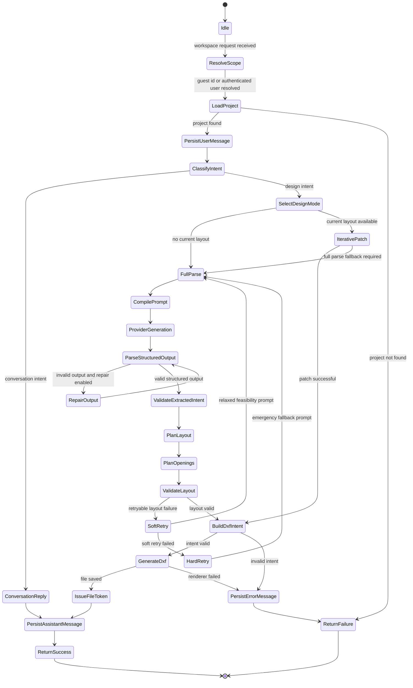

# 02 State Machine Diagram - Workspace Design Request Lifecycle - CadArena

## Purpose
This state machine describes how a workspace request moves through authentication scope, routing, design generation, iterative editing, persistence, and failure handling.

## Diagram

## Architectural Notes
- Guest workspace routes accept a `user_id`; authenticated routes derive user identity from the JWT cookie.
- Retry states are used only for layout and structured-output failures that can be corrected by a relaxed prompt.
- Terminal responses are structured so the frontend can render chat, layout, preview, or error feedback consistently.
