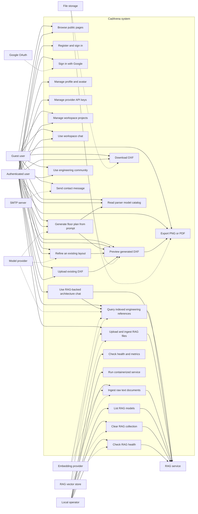

# 03 Use Case Diagram - CadArena User Capabilities

## Purpose
This use case diagram summarizes the current capabilities exposed by CadArena to guests, authenticated users, administrators of local services, and external integrations.

## Diagram

## Architectural Notes
- Guests use cookie-bound workspace identity; authenticated users use the JWT-backed `/workspace/me` route set.
- The design parser can call local Ollama, Ollama Cloud compatible endpoints, Qwen-compatible cloud endpoints, or a local HuggingFace model.
- ArchChat is authenticated and delegates retrieval requests to the standalone RAG API.
- The standalone RAG API supports reference querying, text ingestion, file ingestion, model listing, collection clearing, and health checks.
- RAG ingestion uses the configured embedding provider and stores vectors in the configured vector store, Qdrant by default.
- DXF preview, download, upload, and export are token-mediated file operations.
